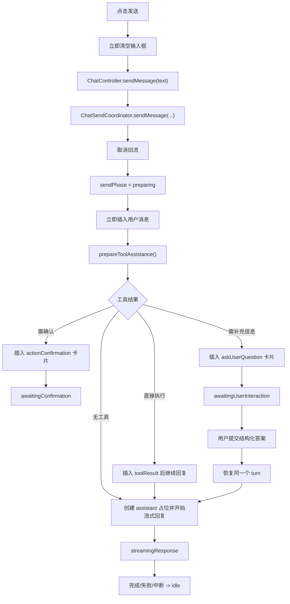

# AI Chat Flutter App

一个面向移动端的 Flutter AI Chat 应用，支持流式对话、多会话、本地持久化、可扩展 Tool Call、结构化消息展示，以及 Android/Web 自动化回归。

示例 APK 位于 `./FlutterAIChat.apk`。

## 当前能力

### 聊天与会话
- 多会话管理，支持创建、切换、删除会话
- 消息本地持久化，支持分页加载历史消息
- 进入会话默认定位到最新消息，向上滑动查看更早历史
- 流式回复、手动中断、生成中自动跟随；手动上滑后可自由查看，点击回到底部后再恢复跟随
- 深度思考模式、自定义系统提示词

### Tool Call 与结构化输出
- 支持工具决策、确认执行、执行结果展示、失败回退
- 工具流程支持语义分型展示：上下文采集类工具默认折叠为低占用 inline step，外部动作类工具保留显式 outcome card，用户可处理失败升级为 exception card
- 支持 `AskUserQuestion` interaction tool，可在同一个 turn 内挂起提问并在用户提交结构化答案后恢复
- `AskUserQuestion` 支持单选、多选、自动追加 `Other`，并以 workflow 风格消息卡片承载交互
- 支持普通 assistant 消息重新结构化为调试卡片
- 支持结构化 trace，覆盖发送、LLM、工具确认、工具执行等关键链路
- planner 只走 provider-native `planNextDecision()` 单一路径，legacy JSON planner 已移除
- `ToolDefinition.descriptionForModel` 是模型侧工具描述的唯一来源，不再维护额外的 `PlannerPromptBuilder`
- 同一个模型决策可同时包含 assistant 文本和多个 tool call，不再强制“工具调用”和“文本回复”二选一
- turn 内多次 tool use 会持久化到 `chat_turn_steps`，后续决策统一消费 ledger summary，而不是把原始工具明细全文回填给模型
- 中间态 assistant 文本会以 `assistantPlannerMessage` 事件落库，便于在工具执行前保留模型可见解释
- Prompt 统一通过 `lib/services/prompt/` 下的 catalog / builder 组装，按 `base prompt`、`stage delta`、`runtime sections`、`context messages` 四类心智模型管理
- 核心 prompt 同时维护英文版与中文版，默认使用英文版
- `summary` 与标题生成等轻量调用走轻量 prompt，不复用完整主对话 prompt
- `final answer` 改为按需阶段；无需额外整理时，不再固定追加一次模型调用

### 自动化
- Flutter Web 固定 origin 回归测试
- Android Droidrun 真机冒烟测试
- Driver 式确定性脚本与 Agent 式脚本双轨并存
- Debug 测试案例统一维护在 `assets/debug/test_cases.json`
- Debug 模式下可通过聊天页顶部的 `Cases` 入口查看全量案例，并将 prompt 一键填入输入框

## 架构概览

当前架构已经从“大一统 provider 文件”拆为更清晰的分层：

### UI 层
- `lib/pages/`
- `lib/widgets/`

UI 只消费 Riverpod providers 和 controller 门面，不直接编排复杂业务。

### Provider 装配层
- [lib/providers/chat_providers.dart](/Users/zyb_wl/flutterSpace/FlutterAIChat/lib/providers/chat_providers.dart)
- [lib/providers/chat_collection_providers.dart](/Users/zyb_wl/flutterSpace/FlutterAIChat/lib/providers/chat_collection_providers.dart)
- [lib/providers/chat_dependency_providers.dart](/Users/zyb_wl/flutterSpace/FlutterAIChat/lib/providers/chat_dependency_providers.dart)
- [lib/providers/chat_send_state_providers.dart](/Users/zyb_wl/flutterSpace/FlutterAIChat/lib/providers/chat_send_state_providers.dart)
- [lib/providers/chat_interaction_providers.dart](/Users/zyb_wl/flutterSpace/FlutterAIChat/lib/providers/chat_interaction_providers.dart)
- [lib/providers/chat_ui_providers.dart](/Users/zyb_wl/flutterSpace/FlutterAIChat/lib/providers/chat_ui_providers.dart)

`chat_providers.dart` 现在主要负责 controller/provider 装配与 re-export，业务逻辑已拆出。

### Controller 层
- [lib/controllers/chat_controller.dart](/Users/zyb_wl/flutterSpace/FlutterAIChat/lib/controllers/chat_controller.dart)
- [lib/controllers/chat_send_coordinator.dart](/Users/zyb_wl/flutterSpace/FlutterAIChat/lib/controllers/chat_send_coordinator.dart)
- [lib/controllers/chat_session_coordinator.dart](/Users/zyb_wl/flutterSpace/FlutterAIChat/lib/controllers/chat_session_coordinator.dart)
- [lib/controllers/chat_summary_controller.dart](/Users/zyb_wl/flutterSpace/FlutterAIChat/lib/controllers/chat_summary_controller.dart)
- [lib/controllers/chat_debug_controller.dart](/Users/zyb_wl/flutterSpace/FlutterAIChat/lib/controllers/chat_debug_controller.dart)
- [lib/controllers/chat_preferences_controller.dart](/Users/zyb_wl/flutterSpace/FlutterAIChat/lib/controllers/chat_preferences_controller.dart)
- [lib/controllers/chat_interaction_coordinator.dart](/Users/zyb_wl/flutterSpace/FlutterAIChat/lib/controllers/chat_interaction_coordinator.dart)

职责分工：
- `ChatController`：页面门面与跨子域协调
- `ChatSendCoordinator`：发送事务、工具确认、流式回复生命周期
- `ChatInteractionCoordinator`：问题卡片草稿、结构化答案提交、interaction 恢复入口
- `ChatSessionCoordinator`：会话加载、切换、删除、分页
- `ChatSummaryController`：会话总结与自动总结定时逻辑
- `ChatDebugController`：结构化调试入口
- `ChatPreferencesController`：系统提示词、推理模式

### Prompt 管理
- `lib/services/prompt/prompt_catalog.dart`
- `lib/services/prompt/prompt_builder_service.dart`
- `lib/services/prompt/prompt_runtime_context_builder.dart`

职责分工：
- `PromptCatalog`：维护双语 prompt 文本块
- `PromptBuilderService`：根据阶段和运行时输入组装最终 prompt
- `PromptRuntimeContextBuilder`：将用户自定义 system prompt 等运行时信息包装为附加 section

### Service 层
- [lib/services/chat_service.dart](/Users/zyb_wl/flutterSpace/FlutterAIChat/lib/services/chat_service.dart)
- `tool/runtime`、`trace`、`response parser` 等服务

Service 层负责 LLM 通信、上下文选择、工具编排与 trace 记录。

## 消息发送链路

发送入口在 `ChatInput`，发送事务主编排在 `ChatSendCoordinator`，问题型交互由 `ChatInteractionCoordinator` 编排提交恢复，模型请求与工具预处理在 `ChatService`。

### 主流程



### 发送状态

发送事务统一由 `ChatSendState` 驱动：

- `idle`
- `preparing`
- `awaitingConfirmation`
- `awaitingUserInteraction`
- `executingTool`
- `streamingResponse`

派生状态：
- `sendPhaseProvider`
- `isGeneratingProvider`

### 交互规则

- 点击发送后，输入框立即清空，用户消息立即上屏
- `preparing`、`executingTool`、`streamingResponse` 阶段输入区锁定
- `awaitingConfirmation` 阶段等待用户继续/取消
- `awaitingUserInteraction` 阶段等待用户在消息卡片内补充结构化答案
- `streamingResponse` 阶段再次点击发送按钮会中断当前流式输出

## Tool Call 与 Trace

### Tool Call 设计原则
- Tool 定义、运行时注册、执行与展示应保持解耦
- interaction-style tool 和 immediate tool 要分开建模，`AskUserQuestion` 不应伪装成一次普通工具执行
- 新增 tool 时优先复用 runtime/handler 机制，而不是在多个 `switch` 里重复枚举
- 用户可见工具操作应考虑确认策略、白名单策略与失败回退
- `ToolDefinition` 同时承担 runtime metadata 与 planner metadata，新增 tool 时要补齐 `descriptionForModel`、`whenToUse`、`whenNotToUse`、`argumentSchema`
- `descriptionForModel` 是 planner 暴露给模型的唯一工具说明来源，避免重复维护外部 prompt 模板
- planner 工具可见性应来自 runtime registry 与 policy/filter，而不是硬编码工具名路由或独立白名单
- 主编排层只依赖 provider-native `ModelTurnDecision`，不再保留 legacy planner 执行分支
- 单个 `ModelTurnDecision` 可以同时携带 assistant 文本和 tool calls；assistant 文本既可能是中间解释，也可能是终态答复
- 对 native tool-calling provider，tool continuation item 由 turn-step ledger 构建；interaction tool 也必须完成对应 step 并写入结构化 `resultJson`

### 日志与 Trace 规范
- 日志、trace、临时日志的统一约束见 `docs/architecture/logging.md`
- 新增关键 feature 时，默认评估是否需要补充日志锚点与排障覆盖

## 自动化

### Web
推荐固定 origin：

```bash
fvm flutter run -d web-server --release --web-hostname 127.0.0.1 --web-port 7357
```

### Android

```bash
# 真机确定性发送冒烟
bash scripts/android_droidrun_driver_smoke.sh

# 真机 Agent 式聊天冒烟
bash scripts/android_droidrun_chat_smoke.sh
```

## 开发约定

- 架构发生变化时，同步更新 `README.md`
- 项目要求、开发约束、实现守则发生变化时，同步更新 `AGENTS.md`
- 新增 feature 时，先判断是否需要同步补充：
  - README 的能力说明或架构说明
  - AGENTS 的实现约束
  - 自动化测试
  - `docs/architecture/logging.md` 中的日志锚点与排障链路

## Feature Backlog

中长期待办放在：

- [docs/feature_todo.md](/Users/zyb_wl/flutterSpace/FlutterAIChat/docs/feature_todo.md)

当前 backlog 包括：
- context 管理策略升级，并在达到上限时自动压缩
- 支持多模型同时配置，让低端模型承担轻量任务，例如会话总结
- session 总结功能优化，例如超过 N 分钟无对话后自动总结本次会话
