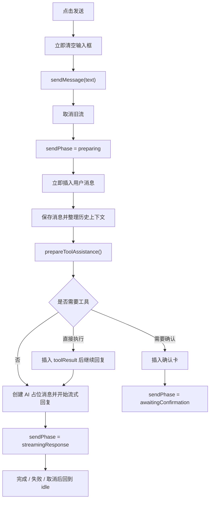

# AI Chat Flutter App

一个基于 Flutter 开发的智能聊天应用，支持多分组对话、本地存储、深度思考模式等功能。

示例Apk在./FlutterAIChat.apk文件

## 功能特点

### 核心功能
- **多分组对话**：支持创建多个对话分组，自动按天分组
- **本地数据存储**：使用 SQLite 数据库存储所有对话记录
- **流式响应**：AI 回复支持流式显示，提供更好的用户体验
- **历史消息管理**：支持分页加载历史消息，支持消息对删除

### 智能模式
- **深度思考模式**：开启后 AI 会给出详细的推理过程
- **简洁模式**：一键切换极简回答，自动暂存和恢复系统提示词
- **自定义系统提示词**：每个分组可独立设置系统提示词

### 用户体验
- **自适应界面**：支持 iOS/Android 平台，适配深色模式
- **智能滚动**：生成时自动滚动，手动滚动时可暂停
- **消息操作**：支持长按消息复制、删除等操作
- **手势支持**：支持侧滑打开侧边栏

## 技术架构

### 状态管理
- 使用 `flutter_riverpod` 进行状态管理
- 采用 Provider 模式组织代码结构

### 数据层
- 使用 `sqflite` 进行本地数据存储
- 实现了消息和分组的 CRUD 操作
- 支持分页加载和自动归档

### 业务逻辑
- 采用工厂模式创建 LLM 实例
- 使用策略模式实现上下文管理
- 实现了混合策略的上下文选择

## 消息发送链路

消息发送入口在 `ChatInput`，业务编排在 `ChatController`，模型请求与工具预处理在 `ChatService`。

### 主流程



### 发送状态

发送事务使用 `ChatSendPhase`：

- `idle`：空闲状态，可输入、可发送、可切换会话
- `preparing`：正在准备上下文和工具决策
- `awaitingConfirmation`：已展示工具确认卡，等待用户操作
- `executingTool`：正在执行已确认的工具
- `streamingResponse`：正在流式接收 assistant 回复

### 状态职责

- `messagesProvider`
  负责消息列表本身，包括用户消息、assistant 占位消息、确认卡和 toolResult 卡片

- `sendPhaseProvider`
  负责当前发送事务阶段，输入框是否锁定、发送按钮 loading、是否允许切换会话都基于它判断

- `isGeneratingProvider`
  只表示 assistant 是否正在流式输出，主要用于自动滚动和中断当前流

### 交互规则

- 点击发送后，输入框会立即清空，用户消息会立即上屏
- `preparing`、`executingTool`、`streamingResponse` 阶段发送按钮显示 loading
- `awaitingConfirmation` 阶段输入区保持锁定，避免在待确认事务未结束时发送新消息
- `streamingResponse` 阶段点击发送按钮会中断当前流式回复

## 项目结构

```
lib/
├── constants/          # 常量定义
│   └── route_constant.dart
├── database/          # 数据库相关
│   └── database_helper.dart
├── models/            # 数据模型
│   ├── chat_group.dart
│   ├── chat_message.dart
│   ├── context/      # 上下文策略
│   └── llm/          # LLM 模型
├── pages/            # 页面
│   ├── chat_page.dart
│   ├── settings_page.dart
│   └── test_page.dart
├── providers/        # 状态管理
│   └── chat_providers.dart
├── services/         # 服务层
│   └── chat_service.dart
├── utils/           # 工具类
│   └── logger.dart
├── widgets/         # UI 组件
│   ├── chat_drawer.dart
│   ├── chat_input.dart
│   ├── chat_message_list.dart
│   └── markdown/    # Markdown 渲染
└── main.dart        # 应用入口
```

## 快速开始

### 环境要求
- Flutter 3.0.0 或更高版本
- Dart 2.17.0 或更高版本

### 安装步骤
1. 克隆项目
```bash
git clone [项目地址]
```

2. 安装依赖
```bash
flutter pub get
```

3. 运行项目
```bash
flutter run
```

### 配置说明
1. 在 `lib/providers/chat_providers.dart` 中配置你的 AI 服务
2. 在 `lib/models/llm/llm_factory.dart` 中添加或修改 LLM 模型
3. 在 `lib/models/context/context_strategies.dart` 中调整上下文策略

## 使用说明

### 基本操作
- 点击左上角菜单按钮打开侧边栏
- 点击右上角"+"创建新对话
- 点击顶部标题可设置系统提示词
- 长按消息可进行复制、删除操作

### 模式切换
- 点击"深度思考"按钮开启/关闭推理模式
- 点击"简洁模式"按钮开启/关闭极简回答
- 两种模式可独立使用，互不影响

## 开发计划

### 近期计划
- [ ] 支持更多 AI 模型接入
- [ ] 添加消息导出功能
- [ ] 优化上下文管理策略
- [ ] 添加语音输入功能

### 长期计划
- [ ] 支持多端同步
- [ ] 添加插件系统
- [ ] 支持自定义主题
- [ ] 添加更多交互方式

## 贡献指南

1. Fork 项目
2. 创建特性分支 (`git checkout -b feature/AmazingFeature`)
3. 提交更改 (`git commit -m 'Add some AmazingFeature'`)
4. 推送到分支 (`git push origin feature/AmazingFeature`)
5. 提交 Pull Request

## 许可证

本项目采用 MIT 许可证 - 详见 [LICENSE](LICENSE) 文件

## 联系方式

如有问题或建议，请通过以下方式联系：
- 提交 Issue
- 发送邮件至：[你的邮箱]

## 致谢

感谢所有为本项目做出贡献的开发者！
