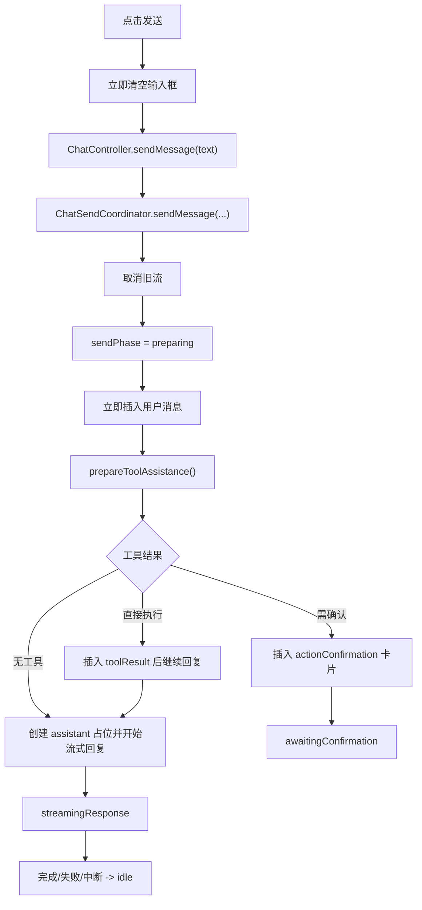

# AI Chat Flutter App

一个面向移动端的 Flutter AI Chat 应用，支持流式对话、多会话、本地持久化、可扩展 Tool Call、结构化消息展示，以及 Android/Web 自动化回归。

示例 APK 位于 `./FlutterAIChat.apk`。

## 当前能力

### 聊天与会话
- 多会话管理，支持创建、切换、删除会话
- 消息本地持久化，支持分页加载历史消息
- 流式回复、手动中断、生成中自动滚动
- 深度思考模式、简洁模式、自定义系统提示词

### Tool Call 与结构化输出
- 支持工具决策、确认执行、执行结果展示、失败回退
- 工具流程支持折叠卡片、结果摘要行、确认卡
- 支持普通 assistant 消息重新结构化为调试卡片
- 支持结构化 trace，覆盖发送、LLM、工具确认、工具执行等关键链路

### 自动化
- Flutter Web 固定 origin 回归测试
- Android Droidrun 真机冒烟测试
- Driver 式确定性脚本与 Agent 式脚本双轨并存

## 架构概览

当前架构已经从“大一统 provider 文件”拆为更清晰的分层：

### UI 层
- `lib/pages/`
- `lib/widgets/`

UI 只消费 Riverpod providers 和 controller 门面，不直接编排复杂业务。

### Provider 装配层
- [lib/providers/chat_providers.dart](/Users/skka/flutterSpace/FlutterAIChat/.worktrees/codex-toolcall-ui/lib/providers/chat_providers.dart)
- [lib/providers/chat_collection_providers.dart](/Users/skka/flutterSpace/FlutterAIChat/.worktrees/codex-toolcall-ui/lib/providers/chat_collection_providers.dart)
- [lib/providers/chat_dependency_providers.dart](/Users/skka/flutterSpace/FlutterAIChat/.worktrees/codex-toolcall-ui/lib/providers/chat_dependency_providers.dart)
- [lib/providers/chat_send_state_providers.dart](/Users/skka/flutterSpace/FlutterAIChat/.worktrees/codex-toolcall-ui/lib/providers/chat_send_state_providers.dart)
- [lib/providers/chat_ui_providers.dart](/Users/skka/flutterSpace/FlutterAIChat/.worktrees/codex-toolcall-ui/lib/providers/chat_ui_providers.dart)

`chat_providers.dart` 现在主要负责 controller/provider 装配与 re-export，业务逻辑已拆出。

### Controller 层
- [lib/controllers/chat_controller.dart](/Users/skka/flutterSpace/FlutterAIChat/.worktrees/codex-toolcall-ui/lib/controllers/chat_controller.dart)
- [lib/controllers/chat_send_coordinator.dart](/Users/skka/flutterSpace/FlutterAIChat/.worktrees/codex-toolcall-ui/lib/controllers/chat_send_coordinator.dart)
- [lib/controllers/chat_session_coordinator.dart](/Users/skka/flutterSpace/FlutterAIChat/.worktrees/codex-toolcall-ui/lib/controllers/chat_session_coordinator.dart)
- [lib/controllers/chat_summary_controller.dart](/Users/skka/flutterSpace/FlutterAIChat/.worktrees/codex-toolcall-ui/lib/controllers/chat_summary_controller.dart)
- [lib/controllers/chat_debug_controller.dart](/Users/skka/flutterSpace/FlutterAIChat/.worktrees/codex-toolcall-ui/lib/controllers/chat_debug_controller.dart)
- [lib/controllers/chat_preferences_controller.dart](/Users/skka/flutterSpace/FlutterAIChat/.worktrees/codex-toolcall-ui/lib/controllers/chat_preferences_controller.dart)

职责分工：
- `ChatController`：页面门面与跨子域协调
- `ChatSendCoordinator`：发送事务、工具确认、流式回复生命周期
- `ChatSessionCoordinator`：会话加载、切换、删除、分页
- `ChatSummaryController`：会话总结与自动总结定时逻辑
- `ChatDebugController`：结构化调试入口
- `ChatPreferencesController`：系统提示词、推理模式、简洁模式

### Service 层
- [lib/services/chat_service.dart](/Users/skka/flutterSpace/FlutterAIChat/.worktrees/codex-toolcall-ui/lib/services/chat_service.dart)
- `tool/runtime`、`trace`、`response parser` 等服务

Service 层负责 LLM 通信、上下文选择、工具编排与 trace 记录。

## 消息发送链路

发送入口在 `ChatInput`，发送事务主编排在 `ChatSendCoordinator`，模型请求与工具预处理在 `ChatService`。

### 主流程



### 发送状态

发送事务统一由 `ChatSendState` 驱动：

- `idle`
- `preparing`
- `awaitingConfirmation`
- `executingTool`
- `streamingResponse`

派生状态：
- `sendPhaseProvider`
- `isGeneratingProvider`

### 交互规则

- 点击发送后，输入框立即清空，用户消息立即上屏
- `preparing`、`executingTool`、`streamingResponse` 阶段输入区锁定
- `awaitingConfirmation` 阶段等待用户继续/取消
- `streamingResponse` 阶段再次点击发送按钮会中断当前流式输出

## Tool Call 与 Trace

### Tool Call 设计原则
- Tool 定义、运行时注册、执行与展示应保持解耦
- 新增 tool 时优先复用 runtime/handler 机制，而不是在多个 `switch` 里重复枚举
- 用户可见工具操作应考虑确认策略、白名单策略与失败回退

### Trace 设计原则
- 新增关键 feature 时，默认评估是否需要 trace/log 覆盖
- 至少要考虑：入口事件、关键状态跳转、失败分支、用户确认动作
- trace payload 应尽量结构化，避免只留下不可检索的自由文本日志

## 自动化

### Web
推荐固定 origin：

```bash
fvm flutter run -d web-server --release --web-hostname 127.0.0.1 --web-port 7357
```

### Android

```bash
# 真机确定性发送冒烟
bash scripts/android_droidrun_driver_smoke.sh

# 真机 Agent 式聊天冒烟
bash scripts/android_droidrun_chat_smoke.sh
```

## 开发约定

- 架构发生变化时，同步更新 `README.md`
- 项目要求、开发约束、实现守则发生变化时，同步更新 `AGENTS.md`
- 新增 feature 时，先判断是否需要同步补充：
  - README 的能力说明或架构说明
  - AGENTS 的实现约束
  - 自动化测试
  - trace/log 链路

## Feature Backlog

中长期待办放在：

- [docs/feature_todo.md](/Users/skka/flutterSpace/FlutterAIChat/.worktrees/codex-toolcall-ui/docs/feature_todo.md)

当前 backlog 包括：
- context 管理策略升级，并在达到上限时自动压缩
- 支持多模型同时配置，让低端模型承担轻量任务，例如会话总结
- session 总结功能优化，例如超过 N 分钟无对话后自动总结本次会话
