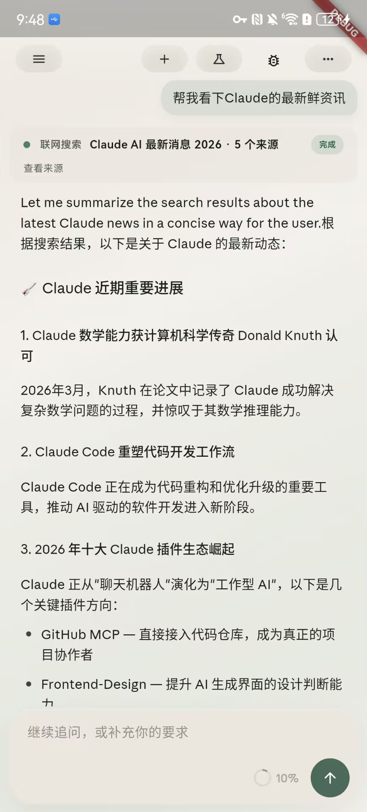
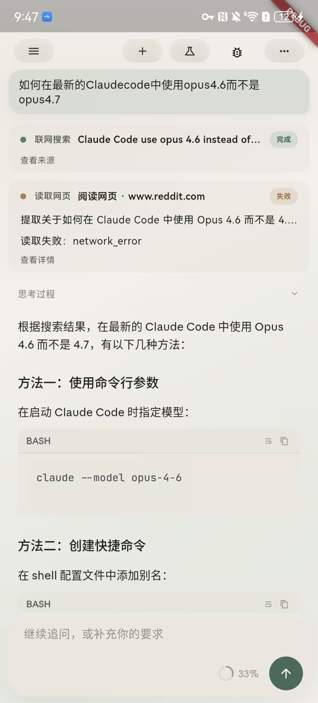
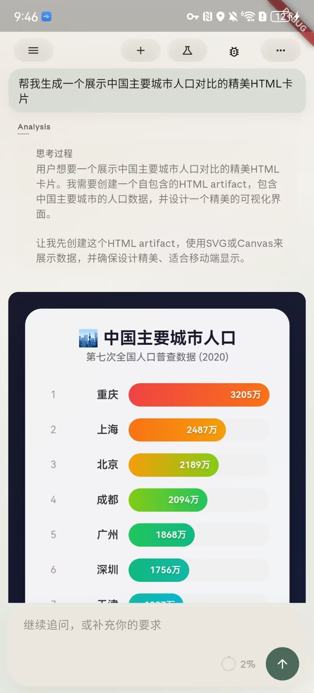
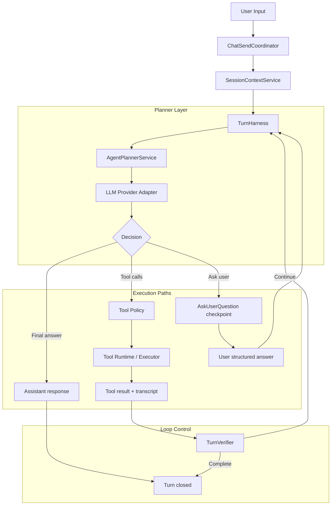

# Flutter AI Chat

一个基于 Flutter 的 AI Chat 应用原型，聚焦多会话聊天、流式回复、工具调用、结构化交互，以及面向长对话与多步任务的 Agent 体验。

示例 APK 位于 [FlutterAIChat-public-release.apk](./FlutterAIChat-public-release.apk)。

适合关注这些方向的读者快速了解：

- Flutter 多端 AI 应用怎么做出不止于“聊天壳”的交互体验
- Tool Calling、结构化追问、恢复执行如何落到移动端 UI
- 长对话上下文、模型接入兼容和自动化验证如何一起演进

## Screenshots

- 可直接下载示例安装包：[FlutterAIChat-public-release.apk](./FlutterAIChat-public-release.apk)
- 当前界面示例覆盖了联网搜索、工具工作流和 artifact 可视化回答

| 联网搜索与答案整理 | 工具卡片与结构化工作流 | Artifact 可视化回答 |
| --- | --- | --- |
|  |  |  |

## 功能特点

- 多会话聊天：支持创建、切换、删除会话，并保留本地聊天记录
- 流式回复体验：支持流式生成、手动中断、生成中自动跟随与历史回看
- 长对话上下文管理：不是简单拼接全部历史，而是按上下文预算保留近期内容并压缩较早历史
- 工具调用工作流：支持搜索、网页读取、文件类工具和结果展示，并可在执行前确认高风险操作
- 结构化追问与恢复：当模型需要补充信息时，可以在同一轮对话中发起问题卡片，等待用户回答后继续执行
- 可视化回答：支持生成 inline artifact，在回答中插入 HTML / SVG 形式的图表、表格或交互式说明；解释增强型 artifact 会先读取配套 guideline，再按项目级 design token 渲染
- 可配置模型接入：支持 provider-first 的多提供方、多模型配置，并可在设置页测试模型连通性
- 可扩展 skills：支持安装、启用和停用本地 skills，为运行时 Agent 增加额外能力

## Engineering Highlights

- 分层式 Flutter 架构：将 UI、状态装配、聊天编排、工具执行、上下文管理和持久化解耦，便于持续扩展
- 面向 Agent 的执行基础设施：围绕 turn / step / event 建模，支持工具确认、结构化追问、挂起恢复和过程可视化
- 长对话上下文基础设施：内建 summary snapshot、token budget 控制和 recent-turn working set，兼顾连续性与成本
- 面向真实接入的验证链路：提供多 provider 兼容、live contract tests、Web 固定 origin 回归和 Android 真机 smoke 脚本

## Agent Loop 架构



想看更完整的全局架构说明，可以从
[docs/architecture/project-architecture-overview.md](./docs/architecture/project-architecture-overview.md)
开始。

## Supported Tools

| Tool | Category | Purpose |
| --- | --- | --- |
| `ask_user_question` | Interaction | 发起结构化问题卡片，在同一轮对话中等待用户补充信息后继续执行 |
| `create_artifact:guideline` | Visualization | 在首次解释增强型 artifact 创建前返回宿主渲染 contract、design token 引用与布局约束 |
| `create_artifact` | Visualization | 生成 HTML / SVG artifact，用于图表、表格、交互式说明等可视化回答，并复用项目级 design token 与当前主题语言 |
| `skill` | Extension | 调用已安装并启用的 skill，扩展 Agent 的运行时能力 |
| `search_chat_history` | Context | 搜索当前会话的历史内容 |
| `web_search` | Web | 搜索互联网信息并返回候选结果 |
| `fetch_webpage` | Web | 读取指定网页，并按给定 prompt 处理网页内容 |
| `ls` | File | 列出目录内容 |
| `glob` | File | 按模式匹配文件路径 |
| `grep` | File | 在工作区内搜索文本内容 |
| `read` | File | 读取文件内容 |
| `write` | File | 写入文件内容 |
| `edit` | File | 对已有文件执行定向编辑 |
| `create_reminder` | Action | 创建提醒事项 |
| `create_calendar_event` | Action | 创建日历事件 |
| `share_result` | Action | 分享文本结果到系统分享面板 |

## 技术栈

- Flutter
- Riverpod
- SQLite / shared_preferences
- 可配置 LLM provider adapters
- 自定义 Tool Runtime 与 Agent Loop 编排

## 快速开始

本仓库优先使用 Flutter `3.35.7`（Dart `3.9.2`）。如果本机 `flutter` 版本不是 `3.35.7`，请改用 `fvm flutter`。

```bash
fvm flutter pub get
fvm flutter run
```

常用命令：

```bash
fvm flutter analyze
fvm flutter test
```

## 模型与运行时配置

- 模型配置采用 provider-first 结构，可在设置页管理提供方和模型目录
- `ConfigurableHttpLLM` 现在只负责高层编排；协议语义映射由 `ApiStyleAdapter` 负责，请求执行由 `ProtocolExecutionRuntime` 负责，流式事件转换由 runtime 内部的 stream adapter 负责
- 当前统一 runtime registry 已支持根据 Base URL 适配不同 API 风格，包括 OpenAI `responses`、OpenAI `chat/completions` 和 Anthropic `messages`
- OpenAI `chat/completions`、`responses` 与 Anthropic `messages` 已进入统一 runtime registry；其中 OpenAI 两条协议与 Anthropic 非流请求都走 SDK-first 执行
- Anthropic planner streaming 只保留一条正式主链路：`AnthropicMessagesRuntime -> AnthropicStreamEventAdapter -> StreamingDecisionAccumulator`
- legacy `ApiStreamParser` 不再承载 Anthropic planner chunk 解析，避免与正式 runtime 主链路形成双实现漂移
- provider adapter / runtime / live capability matrix 的详细边界见 [docs/architecture/provider-adapter-runtime-and-live-matrix.md](./docs/architecture/provider-adapter-runtime-and-live-matrix.md)
- 本地默认配置位于 [config/local_defaults.json](./config/local_defaults.json)

## 测试与自动化

- Web 回归推荐固定 origin 运行，避免本地存储因 host / port 变化而失效
- Android 提供覆盖安装脚本与 Droidrun 真机冒烟脚本
- LLM 接入改动除了本地测试外，也支持 opt-in 的 live contract tests

常用脚本：

```bash
bash scripts/android_install_debug.sh
bash scripts/android_droidrun_driver_smoke.sh
bash scripts/android_droidrun_chat_smoke.sh
bash scripts/run_live_llm_contract_tests.sh minimax-openai
HEADLESS_LIVE_PROVIDER_RESPONSES=my-responses-provider flutter test --tags live-headless-agent test/integration/chat_send_live/chat_send_live_responses_test.dart
```

## 文档导航

- 全局架构总览：[docs/architecture/project-architecture-overview.md](./docs/architecture/project-architecture-overview.md)
- 架构基线：[docs/architecture/2026-04-13-agent-loop-architecture-baseline.md](./docs/architecture/2026-04-13-agent-loop-architecture-baseline.md)
- Agent Loop 边界：[docs/architecture/agent-loop-boundaries-and-decoupling.md](./docs/architecture/agent-loop-boundaries-and-decoupling.md)
- Session Context 管理：[docs/architecture/session-context-management.md](./docs/architecture/session-context-management.md)
- Tool 展示边界：[docs/architecture/tool-presentation-event-boundary.md](./docs/architecture/tool-presentation-event-boundary.md)
- 日志与排障：[docs/architecture/logging.md](./docs/architecture/logging.md)
- 功能待办：[docs/feature_todo.md](./docs/feature_todo.md)

## 当前项目定位

这是一个仍在持续演进中的 Flutter AI 应用实验项目。它不仅关注聊天界面本身，也在持续探索：

- 多步 Agent 交互在移动端 / 多端 UI 中的呈现方式
- 工具调用与结构化用户交互的产品体验
- 长对话上下文管理与模型接入兼容性
- 更可维护的 AI 应用架构与测试基础设施
