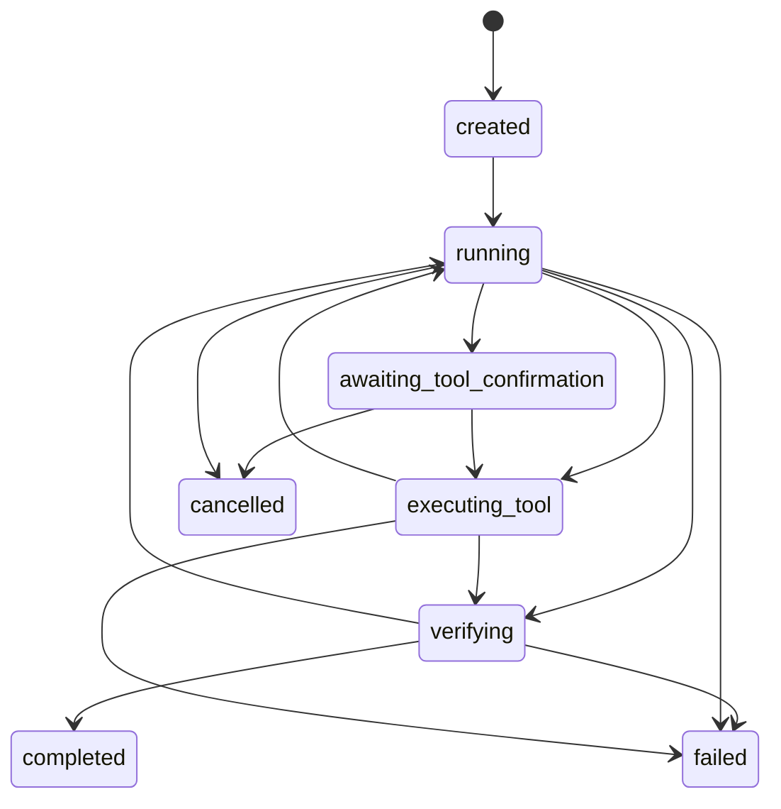

# Agent Loop 架构基线

## 目标

本文档定义项目中 Agent Loop 的长期架构基线。
它规定规范化的运行时模型、组件边界、状态模型，以及未来实现必须遵守的约束。

目标是让 Agent Loop 作为一个系统保持稳定，即使底层模型、工具、存储格式或 UI 展示方式发生变化，这套基线仍然成立。

## 非目标

本文档不负责以下内容：

- 不详细描述当前实现
- 不列出当前代码差距或迁移任务
- 不绑定某个具体模型厂商或 API 形态
- 不规定 Widget 结构或展示细节
- 不逐行定义数据库表结构

当前实现分析与迁移工作应放在独立文档中。

## 核心术语

### Session

`Session` 是长期存在的会话容器。
它承载用户交互、持久化历史、配置以及跨 turn 的长期上下文。

### Turn

`Turn` 是一次由用户请求驱动的完整执行回合。
它从用户提交请求开始，直到系统针对该请求达到终态才结束。
一个 turn 内可以包含多次工具调用和多次内部模型决策。

### Step

`Step` 是 turn 内最小的持久化动作单元。
一个 step 记录一次有意义的运行时动作，例如模型决策、工具调用、工具结果、验证结果或最终响应里程碑。

### Agent Loop

`Agent Loop` 是一个 turn 的标准运行循环：

1. 收集上下文
2. 决定下一步动作
3. 执行动作
4. 验证当前进展
5. 决定继续还是停止

### Harness

`Harness` 是驱动 Agent Loop 的运行时控制器。
它负责协调模型调用、工具执行、transcript 更新、策略检查、验证与停止条件。
它是 turn 运行时的控制平面。

### Planner

`Planner` 是负责产出“下一步决策”的模型层。
它可以产出直接回复、一个或多个工具调用，或者结构化的终态决策。

### Tool Registry

`Tool Registry` 是运行时可用工具的权威目录。
它负责维护每个工具的稳定元数据，包括名称、schema、能力标签、风险信息与平台可用性。

### Tool Policy

`Tool Policy` 是规则层，用于决定一个工具在当前运行时上下文中是否可见、可执行、被阻止，或需要用户确认。

### Tool Invocation

`Tool Invocation` 是模型选择后发出的工具执行请求，包含工具名与结构化参数。

### Tool Result

`Tool Result` 是工具执行后的规范化输出，包含执行状态、摘要、结构化数据，以及失败时的错误信息。

### Verifier

`Verifier` 是判断当前 turn 是否可以结束、是否必须继续的组件。
它检查的是运行时完整性，而不是仅仅判断是否产生了文本。

### Transcript

`Transcript` 是 turn 的追加式运行时记录。
它包含用户输入、模型可见的 assistant 输出、工具调用、工具结果、验证事件与终态事件。

### Sandbox

`Sandbox` 是工具执行所使用的隔离环境。
它为文件操作、shell 执行、网络访问、浏览器自动化等带副作用能力提供受控执行边界。

## Loop 生命周期

标准 turn 生命周期如下：

1. 接收用户输入
2. 创建新的 turn
3. harness 进入运行态
4. harness 加载 session 和 turn 上下文
5. planner 产出下一步决策
6. harness 执行以下三类路径之一：
   - 执行工具调用
   - 等待用户确认
   - 进入终态响应路径
7. 将结果追加到 transcript
8. verifier 判断 turn 是否可以结束
9. harness 决定继续循环或关闭 turn

只有当 turn 进入本文定义的终态之一时，该生命周期才算结束。

## 标准状态机

turn 的标准状态包括：

- `created`
- `running`
- `awaiting_tool_confirmation`
- `executing_tool`
- `verifying`
- `completed`
- `failed`
- `cancelled`

允许的状态迁移如下：

各状态含义如下：

- `created`：turn 记录已创建，但 loop 尚未开始执行
- `running`：harness 正在运行，可能继续请求下一次 planner 决策
- `executing_tool`：至少有一个工具执行正在进行中
- `awaiting_tool_confirmation`：系统刻意暂停，等待用户明确确认
- `verifying`：运行时正在检查 turn 是否满足结束条件
- `completed`：成功终态
- `failed`：失败终态
- `cancelled`：用户取消终态

## 架构组件

### Session Manager

`Session Manager` 负责长期会话状态与 session 级上下文选择。
它不应承担 turn 内工具编排逻辑。

### Turn Harness

`Turn Harness` 负责 turn 内部的运行循环。
它的职责包括：

- 创建和加载 turn 状态
- 加载 transcript 与相关 session 上下文
- 调用 planner
- 路由工具调用
- 追加运行时事件
- 调用验证逻辑
- 决定停止还是继续

它不应包含按具体工具定制的业务逻辑。

### Planner / Model Adapter

`Planner` 及其 provider adapter 负责把运行时上下文转换成模型请求，并将模型返回的结构化决策解析成运行时统一决策。

这一层可以适配 provider 特定的返回格式，但对 harness 来说，最终必须返回一个统一决策契约。

### Tool Registry

`Tool Registry` 负责维护规范化工具元数据。
每个工具定义至少应包含：

- 稳定名称
- 人类可读标题
- 机器可用参数 schema
- capability 标签
- 风险元数据
- 支持的平台列表
- 面向 planner 的描述

### Tool Executor

`Tool Executor` 负责在合适的执行环境中真正运行工具，并返回规范化 tool result。

它不负责判断这个工具是否本该被暴露或被选择。

### Tool Policy

`Tool Policy` 根据当前运行时上下文决定：

- 工具是否对 planner 可见
- 工具是否可执行
- 工具是否必须确认
- 工具是否在当前环境中被阻止

### Verifier

`Verifier` 负责判断 turn 是否已达到合法结束点。
它负责终止正确性，而不是仅仅检查是否已经产出文本。

### Persistence 与 Transcript Store

持久化层负责存储 session、turn、step 以及追加式 transcript 事件。
它必须保留足够的运行时细节，以支持回放、调试和事后评估。

## 数据契约

本节定义的是最小语义契约，具体数据库落表方式可以不同。

### Turn

一个 `Turn` 至少必须包含：

- 稳定 turn 标识
- 所属 session 标识
- 用户输入
- 当前状态
- 迭代次数
- 工具调用次数
- provider continuation state（如果存在）
- turn 关闭时的终止原因

### Step

一个 `Step` 至少必须包含：

- 稳定 step 标识
- 所属 turn 标识
- step 类型
- 顺序索引
- 状态
- 规范化 payload
- 时间戳

### Tool Invocation

一个 `Tool Invocation` 至少必须包含：

- 工具名称
- 规范化参数 payload
- 调用状态
- 是否需要确认
- provider 关联 id（如果存在）

### Tool Result

一个 `Tool Result` 至少必须包含：

- 工具名称
- 执行状态
- 简短摘要
- 结构化结果 payload
- 失败时的规范化错误 payload

### Verification Result

一个 `Verification Result` 至少必须包含：

- `canStop`
- 原因码
- 可选的结构化诊断信息

### Final Response

一个 `Final Response` 至少必须包含：

- 面向用户的最终文本或结构化输出
- 来源 turn 标识
- 停止原因

## 规范性规则

以下规则为强约束。

### Loop 所有权

- harness `MUST` 是唯一拥有 turn loop 的组件
- UI、controller 或 widget 层 `MUST NOT` 直接实现 planner -> tool -> repeat 逻辑
- planner fallback 处理 `MUST` 在进入 harness 之前完成统一归一化

### 决策契约

- planner 层 `MUST` 对 harness 返回统一的决策契约
- provider 特定返回格式 `MAY` 在内部存在，但 `MUST NOT` 泄漏到 harness 的分支逻辑中

### 工具暴露与工具选择

- 工具暴露 `MUST` 基于 registry 元数据与 policy 评估结果决定
- 系统 `MUST NOT` 依赖静态工具名 allowlist 作为 loop 主控制机制
- 系统 `MUST NOT` 在 harness 中按具体工具名进行路由分支
- 工具 prompt `SHOULD` 基于工具元数据动态生成，而不是依赖另一套手写硬编码列表

### 工具执行

- 工具执行策略 `MUST` 在执行时被强制执行，即使 planner 已被正确提示
- 高风险或有副作用的工具 `MUST` 支持基于 policy 的确认机制
- 工具执行器 `MUST` 对成功与失败路径都返回规范化结果

### 验证与停止条件

- turn `MUST NOT` 仅仅因为 assistant 文本非空而结束
- verifier `MUST` 检查未完成工具工作、待确认动作、失败状态以及 loop 完整性
- 停止决策 `MUST` 是显式的且可观测的

### Transcript 与回放

- transcript `MUST` 采用追加式记录模型
- 工具调用、工具结果、验证结果以及终态状态变化 `MUST` 持久化记录
- 系统 `SHOULD` 保留足够元数据，以便事后回放或检查 turn 过程

### 架构分层

- harness `MUST NOT` 承担工具特定的业务语义
- 工具特定的校验与转换 `SHOULD` 放在 tool handler 或 tool adapter 中
- session 级关注点与 turn 级关注点 `MUST` 保持分离

### 命名一致性

- 业务组件命名 `SHOULD` 尽量与本文定义的规范术语保持一致
- 当实现层名称与规范术语不一致时，必须能建立稳定的一对一映射
- 系统 `MUST NOT` 长期依赖大量“概念名”和“代码名”并行存在的隐式映射关系
- 新组件命名 `SHOULD` 优先复用本文中的核心术语，例如 `Session`、`Turn`、`Step`、`Harness`、`Planner`、`Tool Policy`、`Verifier`
- 若因兼容历史原因暂时保留旧命名，相关文档 `MUST` 明确说明其规范对应关系

## Human-in-the-loop

用户确认是 Agent Loop 的一等分支，而不是异常分支。

标准确认流程如下：

1. planner 选择一个工具调用
2. tool policy 将其标记为需要确认
3. harness 将 turn 状态切换为 `awaiting_tool_confirmation`
4. transcript 记录待执行动作
5. 用户选择确认或取消
6. harness 要么恢复执行，要么将 turn 关闭为 `cancelled`

规范性要求如下：

- 需要确认的工具 `MUST NOT` 在确认前自动执行
- 确认后恢复执行 `MUST` 继续原 turn，而不是新开一个无关 turn
- 取消动作 `MUST` 产生可观测的关闭路径或终态结果

## 可观测性

运行时必须提供足够的可观测性，以支持调试、回放与评估。

最小可观测性要求包括：

- 每个 turn 的唯一标识
- 每个 step 的唯一标识
- 状态迁移日志
- 工具调用与结果记录
- planner 决策诊断信息
- 停止原因诊断信息

系统 `SHOULD` 能够在不依赖原始 UI 状态的前提下重建 turn 时间线。

## 可扩展性

未来新增模型 provider、工具和 policy 时，必须通过稳定扩展点接入。

### 新模型 provider

新增 provider 必须：

- 实现统一的 planner / final-response 契约
- 保存 provider 特定 continuation state，但不能把它泄漏成 harness 语义
- 遵守标准 turn 生命周期

### 新工具

新增工具必须：

- 通过 tool registry 注册
- 提供 schema 与元数据
- 通过 tool handler 或 executor adapter 定义执行行为
- 声明风险等级与平台特征

### 新 policy

新增 policy 必须：

- 在 harness 之外评估可见性与执行性
- 保持与既有确认/阻止语义一致

### 新 verifier 逻辑

新增 verifier 必须：

- 基于运行时状态判断完成性
- 保留显式 stop reason
- 避免依赖展示层信号

## 标准示例

示例用户请求：

`搜索 OpenAI 最新新闻，读取最相关网页，然后总结给我。`

标准流程如下：

1. 用户请求创建一个新的 turn
2. harness 加载 transcript 与 session 上下文
3. planner 决定调用 `web_search`
4. harness 执行 `web_search`
5. transcript 记录该工具结果
6. planner 决定调用 `fetch_webpage`
7. harness 执行 `fetch_webpage`
8. transcript 记录该工具结果
9. planner 判断当前信息已足够生成最终响应
10. harness 进入最终回答路径
11. verifier 确认当前 turn 无需继续
12. turn 以 `completed` 结束

这个例子的关键点在于：loop 是由统一的决策、执行、验证契约驱动的，而不是由特定工具的手写编排逻辑驱动的。

## 附录：术语表

- `Session`：长期会话容器
- `Turn`：一次由用户请求驱动的运行循环
- `Step`：turn 内最小持久化动作单元
- `Harness`：loop 的运行时控制器
- `Planner`：负责下一步决策的模型层
- `Tool Registry`：工具元数据目录
- `Tool Policy`：工具可见性与执行规则层
- `Verifier`：完成性判断组件
- `Transcript`：追加式运行日志
- `Sandbox`：隔离执行环境
