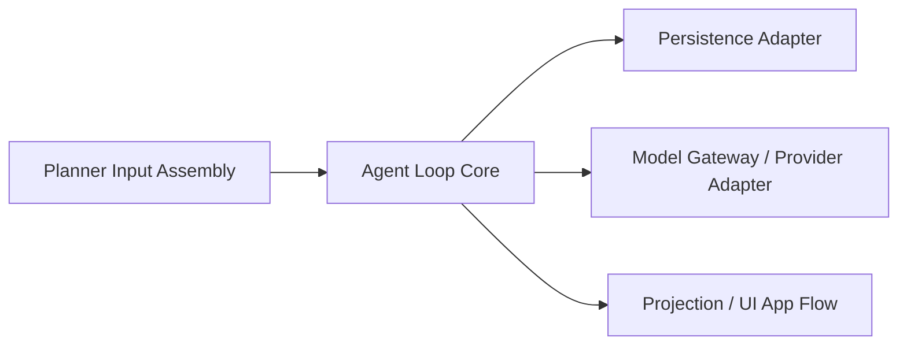

# Agent Loop 边界与解耦约束

## 目标

本文档补充定义当前项目中 Agent Loop 的实现边界与解耦方向。

它服务于两个直接目标：

1. 保证后续重构不偏离 [Agent Loop 架构基线](./2026-04-13-agent-loop-architecture-baseline.md)
2. 让模拟环境集成测试可以更多围绕稳定边界进行，而不是被 UI、DB、provider 细节绑死

本文档不是新的替代架构。
它是在既有基线之上，明确哪些部分属于 `Agent Loop Core`，哪些部分只是围绕 Core 的适配层、投影层与应用编排层。

## 为什么当前模拟环境集成测试低效

当前测试痛点并不主要来自“没有 Agent Loop”。
相反，项目已经具备较完整的 turn ledger、transcript、`TurnHarness` 主循环和等待态恢复链路。

效率低的核心原因是：

1. Core 的结构化输出已经存在，但前端消费路径仍大量依赖 `ChatMessage.payloadJson` 的二次推断
2. 等待态、工具工作流态、问题交互态在 UI 层仍有一部分是通过扫描 `messagesProvider` 反推，而不是通过一层明确的 turn/step projection 来消费
3. 发送事务、trace、runtime marker、harness 驱动、UI provider 更新目前还没有完全拆成清晰的边界，导致外层测试很容易一测就是整条链路
4. Provider/API 侧的大模型协议差异虽然已经有 adapter，但测试目标经常会和 turn loop 正确性混在一起

结果就是：

- 纯单元测试很难覆盖真实交互链路
- 端到端自动化测试又太重、太慢、太脆
- 介于两者之间的“模拟环境集成测试”缺少足够稳定的中间边界

因此，当前最需要补的不是再发明第二套 loop，而是进一步收紧边界，让 Core 的输入输出更独立，让 UI 和持久化更多通过适配与投影层对接。

## 总体分层

当前项目中，建议长期固定为以下五层：

这五层分别回答不同问题：

1. `Planner Input Assembly`
   - “给模型看的上下文是什么”
2. `Agent Loop Core`
   - “这个 turn 下一步做什么、执行什么、何时停”
3. `Model Gateway / Provider Adapter`
   - “不同 provider 的请求/响应协议怎么适配成统一契约”
4. `Persistence Adapter`
   - “turn / step / transcript / snapshot 如何存取”
5. `Projection / UI App Flow`
   - “Core 的结构化结果如何投影为消息、卡片、等待态和页面交互”

### 1. Agent Loop Core

属于 Core 的内容：

- `TurnHarness`
- `AgentPlannerService`
- `DecisionToolCallExecutor`
- `TurnVerifier`
- `ChatTurn`
- `ChatTurnStep`
- `ChatEvent`
- `ModelTurnDecision`

Core 的唯一职责是：

1. 读取一个 turn 当前可用的结构化输入
2. 产出下一步决策
3. 执行工具或交互动作
4. 追加 transcript / step 级结果
5. 判断继续、等待还是结束

Core 不应该直接承担：

- Widget / timeline 展示细节
- provider 状态推断
- SQLite 细节
- 某个 provider 的 HTTP wire format
- prompt 文本拼接细节

### 2. Model Gateway / Provider Adapter

这一层不属于 Agent Loop Core。

它负责：

- 不同 provider 的请求参数适配
- 不同 provider 的能力边界声明
- tool call / continuation / reasoning 等 provider 特定协议兼容
- provider 返回结果解析成统一的 `ModelTurnDecision` 或统一中间结果
- provider 流式增量在适配层内部的规范化、组装与收敛
- provider 请求超时、流空闲超时、整体流式尝试超时等传输级控制

典型内容包括：

- `configurable_http_llm.dart`
- 各 provider continuation/wire adapter
- API 风格差异的请求构造与响应解析

为什么不属于 Core：

- Core 关心的是“决策契约”，不是“HTTP 长什么样”
- provider 可以替换，但 `TurnHarness` 不应因此改变主状态机
- 即使 provider 以流式方式返回增量，Core 也只应看到收敛后的统一决策，而不是 provider 原始 chunk

进一步约束：

- planner 的流式 tool call 组装默认只停留在 `Model Gateway / Provider Adapter`
- 若未来某些上层场景需要消费流式中间态，也应先定义独立的上层契约，而不是让 Core 直接理解某家 provider 的 chunk 语义
- `idle timeout` 与 `overall timeout` 属于传输执行策略，不应上抬为 turn loop 语义

进一步地，`API style` 与 `provider capability` 也必须视为两层不同概念：

- `API style`：OpenAI `responses`、OpenAI `chat/completions`、Anthropic `messages`
- `provider capability`：该 provider 真实支持哪些运行路径

一个 provider 即便被识别为 `responses` 风格，也不代表它一定同时支持：

- `stream:true`
- `stream:false`
- append-only transcript replay
- tool round-trip

当前架构已收敛到一条更强约束：planner 只能消费 append-only transcript replay，不再依赖 provider-native continuation。
因此，后续所有 provider 兼容判断都不应再把“风格识别”当成“能力完备”的同义词，也不应把 provider 侧 continuation 当成语义主路径。

### 3. Planner Input Assembly

这一层也不属于 Agent Loop Core。

它负责组织“模型在当前 turn 能看到什么”，包括：

- `SessionContextService`
- `SessionRuntimeMarkerService`
- `PromptBuilderService`
- runtime user context 组装
- planner-visible messages 的投影与预算裁剪

它的核心问题是“输入内容编排”，不是“loop 控制”。

重要边界：

- 是否跨天插 reminder，是输入装配问题，不是 loop 规则
- prompt 五层结构属于输入装配，不属于 Core
- session summary / recent working set / current turn transcript 的拼装属于输入装配，不属于 Core

### 4. Persistence Adapter

这一层负责存储，不属于 Agent Loop Core。

它包括：

- turn / step / event / snapshot repositories
- runtime marker repository
- SQLite 落盘细节
- 读取/写入结构化 ledger 的 DAO 层

重要边界：

- 数据库存储是 Core 的外部依赖，不是 Core 语义本身
- Core 应依赖稳定的持久化契约，而不是页面消息表的偶然结构

### 5. Projection / UI App Flow

这一层负责把 Core 产物变成应用可消费状态。

它包括：

- `AgentEventProcessor`
- `ChatBlockBuilder`
- `ChatSendCoordinator`
- timeline row 渲染
- pending-state / active interaction providers

这一层不属于 Core。

因为它回答的是：

- 哪张卡片怎么展示
- 哪个等待态怎么投影到页面
- 用户确认按钮在哪里
- 当前发送事务如何与焦点、输入框、自动摘要、trace 之类应用行为结合

这些都是“应用外壳层问题”，不是“turn loop 主架构问题”。

## 当前已识别的主要耦合点

以下内容是当前最需要警惕的耦合点。
它们不意味着当前实现错误，而是说明下一阶段重构和测试基建应优先往哪里收边界。

### `AgentEventProcessor`

文件：
- [lib/controllers/agent_event_processor.dart](/Users/zyb_wl/flutterSpace/FlutterAIChat/lib/controllers/agent_event_processor.dart)

现状：

- 直接消费 `ChatEvent`
- 同时写 DB
- 同时更新 `messagesProvider`
- 同时更新 `chatSendStateProvider`

风险：

- 一个类同时承担了 transcript 消费、消息投影、页面状态切换、部分恢复路径判断
- 这会让“验证 event 语义是否正确”和“验证 UI 是否正确”难以分开测试

### `ChatBlockBuilder`

文件：
- [lib/services/chat_block_builder.dart](/Users/zyb_wl/flutterSpace/FlutterAIChat/lib/services/chat_block_builder.dart)

现状：

- 主要从 `ChatMessage` 和 `payloadJson` 反解 tool workflow / tool result / interaction block

风险：

- UI block 仍然强依赖消息层的历史编码方式
- 一旦消息 payload 结构调整，页面展示和测试夹具都会一起受影响

### `chat_ui_providers`

文件：
- [lib/providers/chat_ui_providers.dart](/Users/zyb_wl/flutterSpace/FlutterAIChat/lib/providers/chat_ui_providers.dart)

现状：

- `activeAskUserQuestionMessageProvider` 通过扫描 `messagesProvider` 判断未解决问题态
- `activePendingToolConfirmationProvider` 通过扫描 `messagesProvider` 判断确认态

风险：

- 等待态来源仍然偏向“消息重建”，而不是“turn/step projection”
- 模拟环境测试为了覆盖等待态，往往不得不构造整串消息历史，而不是构造结构化 ledger

### `ChatTimelineRow`

文件：
- [lib/widgets/chat_timeline/chat_timeline_row.dart](/Users/zyb_wl/flutterSpace/FlutterAIChat/lib/widgets/chat_timeline/chat_timeline_row.dart)

现状：

- 仍然依赖 block payload 中的 workflow step 信息

风险：

- UI 最终仍然在消费“消息编码后的结构”，而不是第一手 ledger projection

### `ChatSendCoordinator`

文件：
- [lib/controllers/chat_send_coordinator.dart](/Users/zyb_wl/flutterSpace/FlutterAIChat/lib/controllers/chat_send_coordinator.dart)

现状：

- 同时处理发送事务、trace、runtime markers、turn 创建、harness 调用、UI/provider 状态回写、错误投影

风险：

- 外层编排边界较宽
- 任何“接近真实发送”的测试都很容易跨越过多职责，导致 fixture 重、断言多、定位慢

### `ConfigurableHttpLLM`

文件：
- [lib/models/llm/configurable_http_llm.dart](/Users/zyb_wl/flutterSpace/FlutterAIChat/lib/models/llm/configurable_http_llm.dart)

现状：

- 已经通过 Base URL 推断 API style
- 已经有 provider-specific adapter
- 已经能对部分 continuation 异常做兼容 fallback

风险：

- 当前仍然较容易把 `responses` 风格视为“完整 OpenAI Responses provider”
- 非流式 planner / summary / side-task 路径默认假定 provider 有完整非流式能力
- 真实 relay 的 capability 缺失如果只靠运行时报错暴露，容易被误判成 loop 架构问题

后续方向：

- 在 gateway 层补显式 capability contract
- 让 live contract tests 输出 capability matrix，而不是只有粗粒度 PASS/FAIL
- 保证 capability 缺失不会反向污染 Core 语义

## 不可漂移的长期守则

以下约束用于保证后续重构不偏离 Agent Loop 主架构。

### 1. `TurnHarness` 必须保持唯一主入口

- turn loop 主循环 `MUST` 只从 `TurnHarness` 进入
- 不得把 planner 循环、停止判断、等待态恢复规则重新散落回 controller、provider 或 widget

### 2. Provider/API 协议细节不得进入 Core

- provider 特定的请求参数、字段命名、流式解析细节 `MUST` 留在 Model Gateway / Provider Adapter
- 不得让 `TurnHarness` 或 `TurnVerifier` 理解某个 provider 的私有 wire 协议

### 3. Provider capability 不得伪装成 Core 规则

- `streaming-only`、`non-streaming unsupported` 这类事实 `MUST` 被视为 provider capability 边界
- 不得为了兼容某个 relay，把这些差异改写成 `TurnHarness` 停止规则、等待态规则或 UI workflow 规则

### 4. Live contract tests 必须按 capability 维度解释结果

- 对 `responses` 风格 provider，至少区分：
  - 流式首轮是否通过
  - append-only transcript round-trip 是否通过
  - 非流式 response body 是否正常
- 不得因为某个 provider “能聊天”就默认它完整兼容当前所有 side-task / planner 路径

### 5. Prompt / Session Context 不得回流成 loop 规则

- prompt 拼接
- runtime marker 注入
- session summary / recent working set 选择

以上都属于 Planner Input Assembly。

- 它们可以影响模型看到什么
- 但不应定义 Core 的状态机和停止语义

### 6. DB 与 repository 是适配层，不是 loop 语义

- turn / step / event 的结构化持久化是必须的
- 但“如何写 SQLite”不是 Agent Loop Core 本身
- 新逻辑应尽量依赖 repository 契约，而不是散布直接 SQL 语义

### 7. UI 不得把 `payloadJson` 当成唯一真相源

- `ChatMessage.payloadJson` 可以作为投影载体
- 但等待态、workflow step、interaction state 的真相源不应长期只靠消息扫描推断
- 应逐步向“turn ledger -> projection model -> UI”收敛

### 6. Trace / Summary / 生命周期外围能力不得定义 Core 规则

- `ChatTraceRecorder`
- `ChatSummaryController`
- session lifecycle 管理
- 其他调试与观测能力

这些都可以观察或编排在 Core 周围，但不应成为 loop 正确性的前提条件。

## 对测试架构的直接影响

这个分层的价值，核心体现在测试分层可以更清晰。

### A. Core 级测试

目标：

- 验证 `TurnHarness` 多轮 loop
- 验证 tool call / tool result / verifier / stop reason
- 验证等待态与 resume path

特点：

- 不依赖真实 UI
- 不依赖消息卡片结构
- 可使用 fake planner / fake executor / fake repositories

### B. Provider Adapter 测试

目标：

- 验证各 provider 请求参数映射
- 验证 continuation / tool calling / response parsing
- 验证真实环境调用与失败路径

特点：

- 允许独立于 Agent Loop Core 进行
- 不应把 provider API 兼容问题误归因给 loop 主架构

### C. Projection / UI 集成测试

目标：

- 验证给定结构化 turn/event/step 输出后，页面如何展示
- 验证确认态、问答态、工具结果态的消费逻辑

推荐方向：

- 优先构造 projection 输入，而不是手写整串随意消息
- 尽量减少对 `payloadJson` 历史编码细节的断言

### D. 模拟环境集成测试

目标：

- 不真实发起完整端到端自动化
- 但能在“假 planner / 假 provider / 假工具 / 真投影层”下验证多轮 loop 到页面消费的关键链路

成立前提：

1. Core 输出必须结构化且稳定
2. Projection 层必须能直接消费结构化边界
3. UI 不需要依赖过多消息历史猜状态

这也是本次架构收边界的直接意义。

## 当前推荐的演进方向

后续重构时，优先级建议如下：

1. 保持 `TurnHarness` 作为唯一 turn loop 主入口，不再外溢
2. 继续加强 Core 与 provider adapter 的独立测试，不把 API 兼容问题塞回 loop 逻辑
3. 逐步把等待态、工具工作流态、问题交互态从“扫描消息推断”收敛为“消费 ledger projection”
4. 让 `ChatBlockBuilder` 和 timeline 渲染更多面向稳定 projection model，而不是面向历史 `payloadJson` 编码
5. 缩小 `ChatSendCoordinator` 的职责面，使其更像应用事务编排壳，而不是隐式 loop 控制器

## 与现有文档的关系

本文档与以下文档配套使用：

- [Agent Loop 架构基线](./2026-04-13-agent-loop-architecture-baseline.md)
  - 定义长期不变的核心术语、状态机与主循环基线
- [Session 上下文管理架构](./session-context-management.md)
  - 定义 planner 输入装配与上下文压缩边界

简单说：

- “什么是标准 Agent Loop” 看基线文档
- “模型上下文怎么构建” 看 Session Context 文档
- “哪些部分不属于 Core、为什么这能提升模拟集成测试效率” 看本文档
