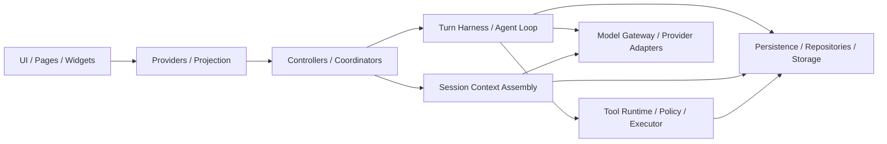
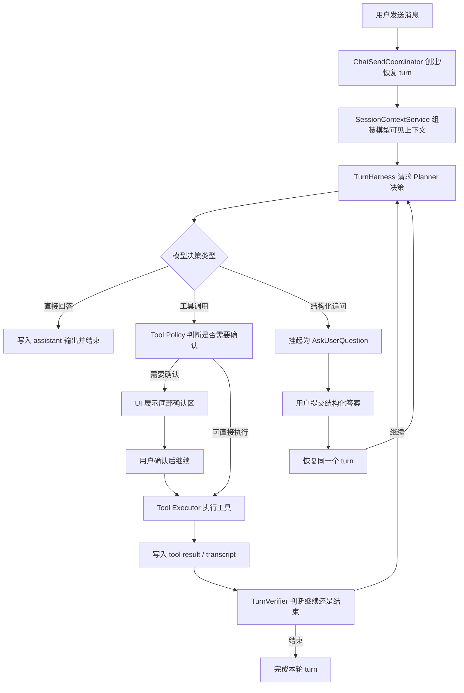

# 项目架构总览

本文档用于提供 Flutter AI Chat 的全局架构视图。

它面向两类阅读场景：

- 想快速理解这个项目整体分层与运行方式
- 想继续深入阅读专题架构文档，但需要先建立全局地图

本文档不追求覆盖所有实现细节，而是回答下面几个问题：

1. 这个项目的核心能力由哪些系统组成
2. 一次用户发送消息后，系统会经过哪些主要阶段
3. 各层职责如何划分
4. 哪些专题已有更细的独立文档

## 项目定位

Flutter AI Chat 不是一个只负责“发请求拿文本”的聊天壳。

当前项目同时探索三件事：

- 多会话、流式回复和本地持久化的基础聊天体验
- 带工具调用、结构化追问和恢复执行的 Agent 式交互
- 面向长对话、真实模型接入和自动化验证的工程基础设施

这意味着项目既包含面向最终交互的 UI，也包含相对完整的 Agent Loop、工具运行时、上下文管理和测试验证链路。

## 总体分层

### 1. UI 层

主要位于：

- `lib/pages/`
- `lib/widgets/`

职责：

- 展示聊天时间线、输入区、设置页、模型管理页等界面
- 承载工具确认条、问题卡片、artifact 预览等交互组件
- 消费 provider 暴露的投影状态，而不是直接编排复杂业务

### 2. Provider / Projection 层

主要位于：

- `lib/providers/`

职责：

- 装配控制器与依赖
- 向 UI 提供可直接消费的状态
- 将底层结构化事实投影为页面所需的等待态、消息列表和上下文窗口信息

这一层是 UI 和核心运行时之间的缓冲带。

### 3. Controller / Coordinator 层

主要位于：

- `lib/controllers/`

职责：

- 编排用户发送消息、会话切换、结构化交互恢复、自动总结等页面级流程
- 协调输入框、滚动行为、工具确认、调试入口和发送状态
- 调用更下层的 Agent Loop、Session Context 和持久化能力

当前职责已经拆分到多个窄控制器，而不是集中在一个超大的 `ChatController` 中。

### 4. Agent Loop Core

核心入口是：

- `TurnHarness`

相关核心概念包括：

- `ChatTurn`
- `ChatTurnStep`
- `ChatEvent`
- `ModelTurnDecision`
- `TurnVerifier`

职责：

- 读取当前 turn 的结构化上下文
- 请求 planner 生成下一步决策
- 路由工具执行、确认或等待用户回答
- 追加 transcript 与 step 级事实
- 判断继续循环、等待还是结束 turn

这一层是项目最接近“Agent runtime”的部分。

### 5. Session Context 层

主要位于：

- `lib/services/session_context_service.dart`
- `lib/services/session_context_projector.dart`
- `lib/services/session_token_budget_service.dart`
- `lib/services/session_summary_service.dart`

职责：

- 为模型组装当前可见的 session 上下文
- 管理历史摘要、近期 turn 和当前 turn transcript 的边界
- 在长对话中控制上下文预算压力
- 为 UI 提供上下文窗口可视化所需的数据快照

这个项目的长对话能力不依赖“把所有消息直接塞给模型”，而是依赖这层基础设施。

### 6. Model Gateway / Provider Adapter 层

主要位于：

- `lib/models/llm/`

职责：

- 适配不同 provider 的请求与响应协议
- 统一不同 API 风格的 tool-calling / continuation / reasoning 能力
- 将 provider 返回结果收敛成统一决策契约

当前运行时已支持根据 Base URL 适配多种 API 风格，包括：

- OpenAI `responses`
- OpenAI `chat/completions`
- Anthropic `messages`

### 7. Tool Runtime 层

主要位于：

- `lib/tools/`
- `lib/services/tool_*`

职责：

- 维护工具注册表和工具元数据
- 根据策略决定工具可见性与是否需要确认
- 调用实际执行器完成搜索、网页处理、文件操作、提醒、分享等动作
- 以统一的 `ToolResult` 返回结果

这一层让“模型决定使用什么工具”和“工具在设备上如何真正执行”之间保持清晰边界。

### 8. Persistence 层

主要位于：

- `lib/database/`
- `lib/repositories/`
- `lib/storage/`

职责：

- 存储聊天消息、turn ledger、事件流、session context snapshot 和设置项
- 同时支持移动端本地数据库与 Web 存储
- 为回放、调试、上下文构建和页面恢复提供持久化事实来源

## 一次发送消息后的主链路

## 关键运行时对象

### Session

长期存在的会话容器，承载：

- 聊天历史
- 会话级配置
- 长期上下文
- session summary / runtime marker

### Turn

一次由用户输入触发的完整执行回合。
一个 turn 可能包含多次 planner 决策和多次工具调用。

### Step

turn 内可持久化的最小动作单元，例如：

- 一次工具调用
- 一次工具结果
- 一次等待用户回答的交互步骤

### Transcript / Event

记录模型、工具和交互过程中的追加式运行时事实。
它既服务于调试，也服务于后续 planner 的上下文构建。

## 工具系统总览

当前内置工具分为几类：

- 上下文与检索：`search_chat_history`、`web_search`、`fetch_webpage`
- 文件与工作区：`ls`、`glob`、`grep`、`read`、`write`、`edit`
- 交互与可视化：`ask_user_question`、`create_artifact`
- 外部动作：`create_reminder`、`create_calendar_event`、`share_result`
- 扩展能力：`skill`

其中有些工具偏“采集上下文”，有些偏“执行动作”，有些则用于在人机之间建立结构化交互检查点。

## 为什么这个架构有辨识度

和常见的聊天 Demo 相比，这个项目的亮点不在于“支持多少模型名称”，而在于：

1. 它把多步 Agent 交互当成一等公民，而不是只做一轮问答
2. 它对长对话上下文、工具结果和恢复执行有明确的数据边界
3. 它已经配套了真实模型接入、live contract tests 和真机 smoke 脚本
4. 它在 Flutter 多端 UI 中探索了工具工作流、问题卡片和 artifact 可视化这些更复杂的交互形态

## 推荐继续阅读

- Agent Loop 架构基线：
  [2026-04-13-agent-loop-architecture-baseline.md](/Users/skka/flutterSpace/FlutterAIChat/docs/architecture/2026-04-13-agent-loop-architecture-baseline.md)
- Agent Loop 边界与解耦：
  [agent-loop-boundaries-and-decoupling.md](/Users/skka/flutterSpace/FlutterAIChat/docs/architecture/agent-loop-boundaries-and-decoupling.md)
- Session Context 管理：
  [session-context-management.md](/Users/skka/flutterSpace/FlutterAIChat/docs/architecture/session-context-management.md)
- Tool 展示边界：
  [tool-presentation-event-boundary.md](/Users/skka/flutterSpace/FlutterAIChat/docs/architecture/tool-presentation-event-boundary.md)
- 日志与排障：
  [logging.md](/Users/skka/flutterSpace/FlutterAIChat/docs/architecture/logging.md)
