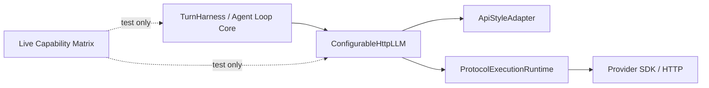

# Provider Adapter / Runtime / Live Matrix 边界说明

## 目标

本文档用于固定当前 LLM provider 接入架构的稳定边界，避免后续在继续推进 Anthropic SDK、兼容 provider、或新增 API style 时，再次把 provider 特定差异回流到 `ConfigurableHttpLLM`、`TurnHarness` 或 UI 层。

本文档重点回答三个问题：

1. 生产链路里，provider 差异应该停留在哪一层
2. `TurnHarness` 与 provider adapter / runtime 的交互契约应该是什么
3. 真实 provider 的不稳定行为应该如何表达，而不污染生产架构

## 总体分层

其中：

- `TurnHarness / Agent Loop Core`
  - 只关心统一的 planner decision、tool round-trip、waiting state、turn stop/continue
- `ConfigurableHttpLLM`
  - 只负责高层编排、重试、timeout、trace、accumulator 接线
- `ApiStyleAdapter`
  - 负责协议语义映射、payload 组装、provider raw response 到统一 decision 的解析
- `ProtocolExecutionRuntime`
  - 负责真实请求执行、SDK/HTTP 调用、流式事件归一化
- `Live Capability Matrix`
  - 只存在于测试层，用来表达具体 provider 的真实能力预期

## 生产层边界

### 1. `TurnHarness` 不理解 provider wire format

`TurnHarness` 的输入输出必须保持在统一语义层：

- 输入：
  - `ModelTurnDecision`
  - `ChatEvent`
  - `ChatTurnStep`
- 输出：
  - tool 执行
  - interaction checkpoint
  - turn 完成 / 等待 / 失败

它不应该直接理解：

- OpenAI `responses` chunk
- OpenAI `chat/completions` delta
- Anthropic `message_start` / `content_block_delta`
- 某个 provider 是否使用 SDK / HTTP

换句话说，provider 可以替换，但 `TurnHarness` 主状态机不应因此改写。

### 2. `ConfigurableHttpLLM` 是高层 orchestrator，不是协议实现层

`ConfigurableHttpLLM` 当前稳定职责应限制为：

- 根据 base URL 解析 `ApiStyle`
- 选择 adapter 与 runtime
- 组织 request purpose
- 统一接线日志、超时、重试、stream accumulator
- 返回统一的 `ModelTurnDecision` 或 side-task 文本结果

它不应继续承担：

- provider-specific HTTP path 修补
- provider-specific SSE 事件解析
- tool call draft 组装细节
- 某个 provider 的 continuation 特判

这些都应停留在 adapter / runtime 内部。

### 3. `ApiStyleAdapter` 与 `ProtocolExecutionRuntime` 的职责划分

#### `ApiStyleAdapter`

负责：

- provider 语义层 payload 组装
- capability 声明
- request options 归一化
- provider raw response -> `ModelTurnDecision`

不负责：

- 真实网络请求
- SDK client 生命周期
- SSE 字节流解析

#### `ProtocolExecutionRuntime`

负责：

- SDK 请求执行
- HTTP fallback
- stream / non-stream 执行
- provider 事件归一化
- provider transport 级别兼容

不负责：

- turn loop 控制
- planner / tool / UI 语义裁决

## 三种 API style 的统一入口

当前三种 API style 都应落在同一条高层链路上：

1. `responses`
2. `chat/completions`
3. `anthropic/messages`

共同要求：

- 上层都返回统一 `ModelTurnDecision`
- 上层都支持 append-only transcript replay
- 上层都不把 provider-native continuation 当作语义主路径

差异只允许存在于：

- adapter payload 结构
- runtime 执行方式
- streaming 事件归一化

## Side Task 与主 planner 的关系

`summary`、`webpage processing`、其他 side-task 也必须走同一套 adapter / runtime 边界，而不是回退到另一条隐藏协议栈。

要求：

- side-task 仍然通过 `ApiStyleAdapter` 组织请求
- side-task 仍然通过 `ProtocolExecutionRuntime` 执行
- provider 特定 path、SDK baseUrl、transport fallback 必须与主 planner 保持同一边界

这也是为什么兼容前缀路由这类问题应修在 runtime，而不是修在调用方。

## Live Capability Matrix 的位置

### 1. 为什么它必须只存在于测试层

真实 provider 往往会出现这种情况：

- API style 正确
- tool round-trip 正确
- append-only transcript replay 正确
- 但某些 structured interaction checkpoint 不稳定

例如：

- `ask_user_question` 可能有时产出结构化 tool call，有时直接退化为普通 assistant 文本
- 写操作 confirmation 可能有时进入共享 waiting state，有时直接 inline 完成

这些差异属于“provider 真实行为画像”，不应倒灌回生产链路。

因此它们应只表达在测试层：

- live provider profile
- shared live assertion helper
- capability matrix

而不应进入：

- `TurnHarness`
- `ConfigurableHttpLLM`
- `ToolOrchestratorService`
- UI 投影主语义

### 2. matrix 的语义

当前 capability matrix 推荐使用显式枚举，而不是简单布尔值：

- `required`
  - 该 provider 应稳定产出结构化 checkpoint
- `opportunistic`
  - 该 provider 可能产出结构化 checkpoint，但真实流量中允许退化

这比 `supports / not supports` 更准确，因为很多兼容 provider 的真实行为不是绝对不支持，而是“不稳定支持”。

### 3. matrix 的维护原则

matrix 应满足：

- 当前默认 provider 要显式登记
- 当前首选 provider 要显式登记
- 已知有特殊行为的 provider 要显式登记
- selector 与 matrix 分离

也就是说：

- selector 负责“选谁”
- matrix 负责“选中后按什么 live 预期验证”

后续新增 provider 时，优先流程应是：

1. 在 matrix 中补一行
2. 说明 checkpoint 预期是 `required` 还是 `opportunistic`
3. 再决定是否需要新的 live case 或新的断言分支

## 当前推荐约束

后续继续演进时，优先保持以下约束不变：

1. `TurnHarness` 继续只消费统一 decision，不消费 provider chunk
2. `ConfigurableHttpLLM` 继续只做 orchestrator，不回收 provider wire 特判
3. adapter 负责语义映射，runtime 负责执行兼容
4. live capability matrix 只存在于测试层
5. provider 行为差异优先落在 matrix / assertion helper，而不是生产逻辑

## 何时才允许上抬 provider 差异

只有满足以下条件时，才应考虑把某个 provider 差异上抬到生产契约：

1. 该差异不是单个 provider 的偶发现象，而是某一类协议/平台的稳定限制
2. 该差异已经影响统一语义契约，而不仅是 live 测试表现
3. 无法继续通过 runtime 兼容、adapter 归一化、或测试矩阵表达来吸收

如果不满足以上条件，默认应留在：

- runtime 兼容层
- adapter capability / normalization 层
- live capability matrix

而不是回流到 `TurnHarness` 主循环。
