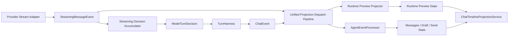

# 流式消息预览与投影管道架构

## 目标

本文档定义项目当前流式消息预览相关架构的现状、问题边界，以及未来迭代必须遵守的约束。

它不是某一次需求的实现说明，也不是 implementation plan。
具体改造方案、字段选择和阶段拆分应放在对应 spec / plan 文档中。

本文档关注的是：

1. 当前系统里主真相链路与流式预览链路分别是什么
2. 两条链路应该如何长期共存
3. 后续所有相关迭代必须遵守哪些边界，避免再次出现双轨不一致

## 当前架构现状

### 1. 主真相链路已经是稳定的事件驱动结构

当前项目中，turn truth 的主链路已经相对清晰：

- `TurnHarness` 驱动 planner / tool / interaction 主循环
- `TurnHarness` 产出 `ChatEvent`
- `AgentEventProcessor` 消费 `ChatEvent`
- processor 写入：
  - `messagesProvider`
  - `runtimeAssistantDraftProvider`
  - `chatSendStateProvider`
- `ChatTimelineProjectionService` 汇聚这些状态并产出统一 timeline projection

这条链路表达的是：

- turn truth
- tool workflow truth
- interaction truth
- final answer truth

它的长期定位不应改变。

### 2. provider streaming 目前主要停留在 LLM 内部

当前 provider 的流式输出能力已经存在，但主要停留在 `ConfigurableHttpLLM` 与相关 runtime / adapter 内部。

典型现状是：

- provider raw stream 在 runtime / adapter 层被适配为统一 `StreamingMessageEvent`
- `StreamingDecisionAccumulator` 在 LLM 层内累积最终 `ModelTurnDecision`
- `RuntimeStreamingPreviewProjector` 消费 preview event，并维护 `RuntimeStreamingPreviewState`
- `ChatTimelineProjectionService` 同时消费 truth state 与 runtime preview state，产出统一 timeline projection

这意味着当前 preview 链路已经具备正式主链路，但仍有两个需要长期约束的点：

1. preview 与 truth 仍是两条不同语义的事件链，需要继续保持边界清晰
2. preview 链路虽然已接入统一 projection 层，但替换时序和 provider 差异控制仍必须被视为架构约束

### 3. 当前 UI 汇聚点已经基本明确

无论是主真相链路还是运行中临时状态，当前项目都倾向于在 `ChatTimelineProjectionService` 做统一投影汇聚。

这是一个正确的长期方向：

- timeline widgets 不应分别理解多套底层状态协议
- projection 层应继续是 UI 的唯一汇聚口

因此，后续演进应围绕“让 preview 链路也能稳定接入统一 projection 层”来展开，而不是让 UI 直接理解 provider delta。

## 当前主要问题

### 1. preview 链路已经成形，但仍需防止重新退化为局部拼接

当前 runtime preview 已经具备正式 event pipeline，但后续迭代仍可能因为局部需求退回到：

- 直接读取某个 provider 的原始 delta
- 在 widget 层临时拼接运行中内容
- 为单个 tool 单独维护第二套预览状态

长期风险是：

- provider 原生 block 结构再次泄漏到上层
- text / thinking / tool-use 的统一 block 语义被破坏
- 新功能围绕局部 case 再开一条专门逻辑

### 2. 临时 preview 与最终正式消息的时序边界没有被上抬为架构约束

当前最脆弱的点不是“能不能看到中间态”，而是：

- 临时 preview 如何被正式消息替换
- 替换过程中如何避免晚到 delta 重新污染正式内容
- 相邻两条 message 的 preview / final 可见顺序如何保证

如果这类逻辑继续分散在多个 provider、多个 projector、多个 UI 写入口里，后续很容易再次出现双轨不一致。

### 3. provider 差异目前还没有被彻底压在适配层

Anthropic、Responses、Chat Completions 的 streaming 结构能力并不相同。

长期正确边界应该是：

- provider 差异留在 runtime / adapter
- 上层统一消费 message / content block 语义

如果让 accumulator、projection、widget 自己补 provider-specific 规则，架构会继续发散。

## 长期目标架构

### 1. 主真相链路保持不变

长期必须坚持：

- `TurnHarness` 继续只消费完整 `ModelTurnDecision`
- `ChatEvent` 继续承担 turn truth event 的角色
- 主循环不依赖 planner mid-stream delta 驱动

也就是说，流式预览能力是运行中旁路能力，不改变 agent loop 的主语义。

### 2. preview 链路也要收敛成正式的事件驱动结构

长期目标不是让 preview 链路“看起来能工作”，而是让它也具备清晰的四段式结构：

1. producer
2. consumer / projector
3. runtime-only state
4. unified projection

这条链路的标准出口应是统一的 preview event，而不是 provider raw chunk，也不是零散快照。

### 3. 两条链路不统一事件类型，但统一消费模式

未来应长期固定：

- `ChatEvent` 是 truth event
- `StreamingMessageEvent` 是 runtime preview event

二者不应合并为同一种业务事件。

但二者必须共享同一个统一消费 / 提交管道，以保证：

- 状态提交顺序可控
- final replace preview 的语义集中
- UI 写入口唯一

## 推荐长期分层

建议后续所有相关迭代都以以下分层为准：

这张图表达的是长期边界，而不是要求当前代码已经完全到位。

## 必须遵守的架构约束

后续所有与流式预览、artifact 渐进渲染、tool-use 中间态、provider streaming 相关的迭代，都必须遵守以下约束。

### 1. provider streaming 适配层只能有一条正式出口

一旦统一 preview event 协议落地后：

- provider runtime / adapter 层只能以这一条正式 preview event 作为对上出口
- 不应长期并行维护第二条等价但语义不完全一致的流式出口

允许存在临时迁移辅助结构，但不应形成长期双轨。

### 2. preview 中间态不进入 transcript truth

运行中 preview state 长期应保持 runtime-only。

它：

- 可以丢失
- 不需要跨重启恢复
- 不应进入 `chat_events` / `chat_turn_steps` / session context truth

一切用户可见历史真相，仍应由正式消息 / 正式 tool workflow event 承担。

### 3. `TurnHarness` 不应理解 provider mid-stream 细节

`TurnHarness` 的职责是：

- 驱动 turn loop
- 调度 tool / interaction
- 判断继续、等待或结束

它不应理解：

- 某个 tool_use 的参数目前流到哪一步
- 某个 preview block 当前追加了多少字符
- 某家 provider 的 streaming chunk 生命周期

这些都必须停留在 LLM adapter、preview event、projector 相关边界内。

### 4. provider 差异必须压在 adapter 层

未来无论 Anthropic、Responses、Chat Completions 如何继续演进，上层都不应直接消费 provider raw chunk 语义。

也就是说：

- synthetic block 规则属于 adapter 层职责
- provider id 映射策略属于 adapter 层职责
- accumulator、projector、timeline projection 不应再自己补 provider-specific 推断

### 5. 统一投影汇聚层必须保持唯一

`ChatTimelineProjectionService` 的长期定位是唯一 UI 汇聚层。

后续不应再引入：

- 第二套直接面向 widget 的 provider delta 解释逻辑
- 第二套 artifact 专属 timeline 构造逻辑
- 第二套“跳过 projection 直接改 widget state”的正式链路

可以有 tool-specific renderer，但不应有 tool-specific streaming architecture。

### 6. preview/final 替换顺序必须由统一消费管道保证

顺序控制应该是管道责任，不应退化为：

- widget 层自己靠时间戳猜顺序
- 多个 provider 分别做一套局部清理
- 每个 tool renderer 自己定义一次替换时机

长期必须保证：

1. final truth 提交时，preview 清理与正式消息提交由统一管道串行仲裁
2. finalized message 的晚到 preview 事件必须被统一丢弃
3. 相邻 message 的可见提交顺序也由统一管道负责

### 7. artifact 不是架构例外

artifact 可以是最重要的消费方，但不是特殊协议。

长期边界应保持：

- artifact renderer 消费统一 preview state 中的 tool-use block
- artifact 不拥有第二套专属 provider streaming 协议
- 其他工具如果未来需要渐进渲染，应复用同一架构

## 对后续迭代的指导

后续如果要继续做：

- create_artifact 渐进渲染
- thinking / text 更细粒度预览
- tool_use 中间态展示
- provider streaming 兼容性扩展
- final message 替换临时 preview 的一致性治理

应优先检查以下问题：

1. 改动是否仍然遵守“truth event 与 preview event 分层”
2. provider 差异是否被压在 adapter 层，而不是泄漏到 projector / widget
3. 是否试图把 preview 中间态塞回 transcript truth
4. 是否又引入了新的并行 streaming 出口
5. 是否破坏了 `ChatTimelineProjectionService` 作为唯一 UI 汇聚层的定位

如果其中任一答案为“是”，应优先回到架构边界重新审视，而不是继续局部补丁。

## 相关文档

- 需求 / 方案设计：
  - [docs/superpowers/specs/2026-05-27-streaming-message-preview-and-projection-pipeline-design.md](/Users/zyb_wl/flutterSpace/FlutterAIChat/docs/superpowers/specs/2026-05-27-streaming-message-preview-and-projection-pipeline-design.md)
- 实现计划：
  - [docs/superpowers/plans/2026-05-27-streaming-message-preview-and-projection-pipeline-implementation-plan.md](/Users/zyb_wl/flutterSpace/FlutterAIChat/docs/superpowers/plans/2026-05-27-streaming-message-preview-and-projection-pipeline-implementation-plan.md)
- 相关边界文档：
  - [agent-loop-boundaries-and-decoupling.md](/Users/zyb_wl/flutterSpace/FlutterAIChat/docs/architecture/agent-loop-boundaries-and-decoupling.md)
  - [provider-adapter-runtime-and-live-matrix.md](/Users/zyb_wl/flutterSpace/FlutterAIChat/docs/architecture/provider-adapter-runtime-and-live-matrix.md)
