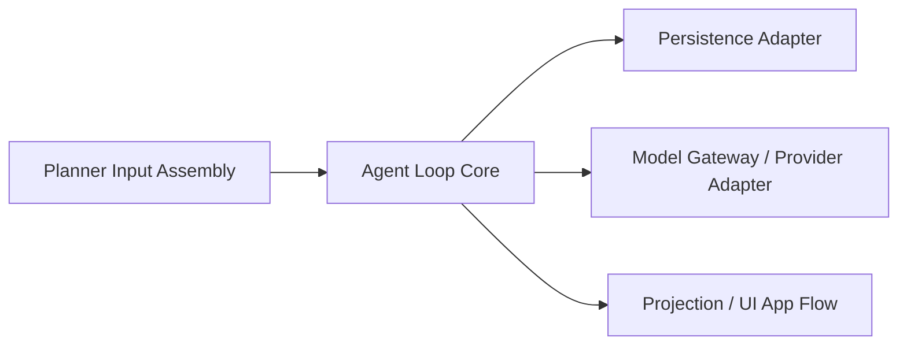
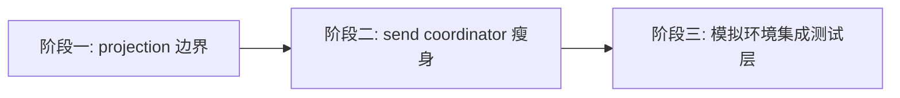

# Agent Loop 解耦与模拟集成测试重构总设计

## 背景

当前项目已经具备较完整的 Agent Loop 主干能力：

- `TurnHarness` 作为统一的 turn loop 入口
- `chat_turns`、`chat_turn_steps`、`chat_events` 作为结构化 ledger
- `SessionContextService` 负责 planner-visible context 组装
- provider adapter 层已经开始承接不同大模型 API 协议差异

从“是否有 loop 主架构”这个角度看，当前系统并不缺主干。
真正的问题在于：这些结构化能力还没有被充分转化为清晰的前后端边界。

目前自动化测试实践里存在两个相反的问题：

1. 纯单测很多，但对真实多轮交互链路的兜底仍然不够
2. 自动化端到端测试过重、过慢、过脆，回归效率低

用户希望把更多验证转向“模拟环境的集成测试”。
要做到这一点，系统必须先具备更清晰的模块边界，让：

- Agent Loop 负责结构化运行时语义
- UI 负责消费结构化投影结果
- DB 负责结构化持久化
- provider/API 适配负责大模型协议兼容

换句话说，本轮工作的重点不是“重写 Agent Loop”，而是进一步把 Agent Loop 和外围系统解耦，让模拟环境集成测试成为高性价比的主战场之一。

## 问题陈述

当前影响测试效率和架构清晰度的核心问题有四类。

### 1. Core 输出已结构化，但 UI 仍大量依赖消息 payload 二次推断

当前很多 waiting state、workflow state、interactive state 的页面消费逻辑，仍然依赖扫描 `messagesProvider` 和 `ChatMessage.payloadJson` 来反推。

这导致：

- UI 对历史消息编码方式耦合较深
- 测试夹具必须构造一长串消息，才能还原某个中间态
- 结构化 ledger 无法成为前端消费和测试的稳定边界

### 2. 发送事务外壳仍承担过多编排职责

`ChatSendCoordinator` 当前同时处理：

- 发送事务入口
- focus/input/stream cancel
- trace 记录
- runtime marker 注入
- turn 创建与 harness 调用
- UI/provider 状态回写
- 部分失败投影

这使得“接近真实发送”的测试天然跨越太多职责，难以快速定位问题。

### 3. Provider/API 协议兼容问题容易与 loop 主语义混在一起

我们已经看到：各种 API 风格的大模型请求仍然可能出现接口传参错误、continuation 兼容问题、tool call 协议差异等。

如果没有明确边界，团队很容易把这类问题当成 Agent Loop 本身的问题处理，最终让 Core 逐步吸收 provider 私有逻辑。

真实环境验证还暴露了一个更细的风险：

- 同样被识别为 OpenAI `responses` 风格的 provider
- 其真实能力完备度也可能明显不同

例如某些 relay / gateway 可能支持：

- `stream:true` 的 SSE 主通路
- stateless continuation（手动重放上下文 / tool transcript）
- tool call -> tool result -> final answer round-trip

但同时又不支持：

- `stream:false` 非流式返回完整 response object
- `previous_response_id`

这说明“API 风格”只能回答“请求/响应大体长什么样”，不能回答“这个 provider 完整支持哪些运行路径”。
如果系统继续把“responses 风格”直接等价成“完整 OpenAI Responses 能力”，provider 兼容问题就会持续泄漏到 loop、UI 与测试层。

### 4. 缺少一层足够稳定的“模拟环境集成测试入口”

当前测试虽然已经覆盖了：

- LLM adapter 路径
- `TurnHarness` 多轮与 resume 路径
- `ChatSendCoordinator` 外层恢复路径

但仍然缺一层更适合日常回归的中间测试形态：

- 不像纯单测那样过于局部
- 也不像全端到端那样过重
- 能在 fake planner / fake provider / fake tool / 真 projection 层条件下，覆盖多轮 loop 到 UI 消费的主路径

## 目标

本轮总设计目标如下：

1. 明确并固定 Agent Loop Core 与外围适配层、投影层、应用事务层的边界
2. 保证未来重构不偏离 `TurnHarness` 为唯一主入口的 Agent Loop 主架构
3. 推动 UI 从“扫描消息反推状态”逐步收敛为“消费结构化 ledger projection”
4. 将 provider/API 兼容问题稳定约束在 adapter 边界内
5. 为模拟环境集成测试建立明确的输入输出边界和测试夹具模型
6. 在不引入大规模兼容层和历史包袱的前提下，分阶段完成重构
7. 将“provider 风格识别”与“provider 能力声明”分离，避免把半兼容 relay 误当成标准 provider

## 非目标

本轮总设计不包含以下目标：

1. 不重写 `TurnHarness` 主状态机
2. 不重新定义 `ChatTurn`、`ChatTurnStep`、`ChatEvent` 的基础语义
3. 不把 UI 全量改写为全新展示系统
4. 不把所有端到端自动化替换掉
5. 不为了“测试方便”向系统引入新的死代码、临时兼容层或第二套 loop
6. 不把 provider 私有协议扩散到 Core、UI 或 DB 层

## 设计原则

### 1. Core 稳定优先

`TurnHarness`、planner decision contract、tool execution contract、verifier/stop reason 必须保持为主干稳定契约。

### 2. 结构化边界优先于启发式补丁

遇到模型可靠性、UI 展示或测试困难问题时，优先修正结构化边界、typed payload、projection contract，而不是继续堆 prompt patch、keyword routing 或局部 if/else。

### 3. 解耦优先于“测试写法技巧”

如果某类测试很难写，优先反推是否边界不清，而不是先接受高复杂度夹具。

### 4. 渐进替换，而不是一次性重写

现有 UI、controller、provider 仍需持续工作。
本轮设计强调分阶段迁移，避免一次性推翻既有链路。

### 5. 死代码及时清理

每个阶段都必须先确认相关功能是否仍然存活。
如果某条旧路径已经废弃，应同步删除，而不是为其补测试或叠加新适配层。

## 目标架构

长期目标架构固定为以下五层：

### 1. Planner Input Assembly

职责：

- 组装 planner-visible context
- 管理 runtime user context
- 管理 session summary / recent completed turns / current turn transcript
- 管理 date-change reminder、runtime marker 等输入装配逻辑

典型组件：

- `SessionContextService`
- `SessionRuntimeMarkerService`
- `PromptBuilderService`
- `SessionContextProjector`
- `SessionTokenBudgetService`

不负责：

- turn loop 状态机
- UI waiting state
- provider 请求协议

### 2. Agent Loop Core

职责：

- 驱动 turn 主循环
- 消费统一 planner decision
- 执行 tool / interaction
- 持久化 step / transcript 级结果
- 判断等待、继续、完成、失败、取消

典型组件：

- `TurnHarness`
- `AgentPlannerService`
- `DecisionToolCallExecutor`
- `TurnVerifier`
- `ChatTurn`
- `ChatTurnStep`
- `ChatEvent`
- `ModelTurnDecision`

不负责：

- provider 私有 wire format
- widget 呈现
- DB 表细节
- prompt 拼接

### 3. Model Gateway / Provider Adapter

职责：

- 兼容各 provider 的 API 风格差异
- 声明并约束各 provider 的能力边界
- 处理 continuation、tool call、reasoning 等 provider 特定协议
- 将 provider 返回统一转换为 Core 可消费契约

典型组件：

- `configurable_http_llm.dart`
- 各 provider 特定 adapter / normalizer

这一层后续应显式承载 provider capability，例如：

- `supportsStreamingResponses`
- `supportsNonStreamingResponses`
- `supportsPreviousResponseId`
- `supportsStatelessContinuation`
- `supportsToolRoundTrip`

这些 capability 不等于 API style。
`responses` / `chat completions` / `anthropic messages` 只是一层协议分类；
真正决定某条运行路径是否可用的，是 capability 组合。

不负责：

- 决定 loop 是否结束
- 定义 UI workflow 状态

### 4. Persistence Adapter

职责：

- 结构化存取 turn / step / event / snapshot / runtime marker
- 封装 DB 细节与 repository 边界

不负责：

- 从消息推断 runtime 语义
- 定义 UI 交互语义

### 5. Projection / UI App Flow

职责：

- 将结构化 runtime 结果投影为 UI 可消费模型
- 渲染 timeline、tool cards、waiting state、interaction state
- 处理发送事务外壳与页面级交互状态

典型组件：

- `AgentEventProcessor`
- `ChatBlockBuilder`
- `ChatSendCoordinator`
- `chat_ui_providers`
- timeline row / tool UI 渲染

不负责：

- 改写 Core 状态机
- 吸收 provider 协议细节

## 当前主要耦合点

### `AgentEventProcessor`

当前既消费 `ChatEvent`，又写 DB，又更新 `messagesProvider` / `chatSendStateProvider`。

问题在于：

- transcript 消费
- UI 消息投影
- 页面状态切换
- 部分恢复路径控制

还没有被拆成更清晰的投影职责。

### `ChatBlockBuilder`

当前主要从 `ChatMessage` 与 `payloadJson` 反解 block。

问题在于：

- 它更多是在解释“消息怎么编码过”
- 而不是直接消费“loop 已产出的结构化工作流信息”

### `chat_ui_providers`

当前 `activeAskUserQuestionMessageProvider`、`activePendingToolConfirmationProvider` 仍然依赖消息扫描。

问题在于：

- waiting state 的真相源不够清晰
- projection 层和 UI 层之间缺少显式中间模型

### `ChatSendCoordinator`

当前职责面过宽，既像发送事务外壳，又隐含承担部分运行时编排职责。

问题在于：

- 集成测试很难缩小作用域
- 后续任何小改动都容易牵动大链路

### `ConfigurableHttpLLM` 的“风格识别”与“能力假设”仍未完全分离

当前系统已经能根据 Base URL 自动识别：

- OpenAI `responses`
- OpenAI `chat/completions`
- Anthropic `messages`

但真实 provider 验证表明，这还不够。

问题在于：

- planner / summary / side-task 当前默认使用非流式请求
- 某些 `responses`-like provider 实际只支持流式主通路
- 某些 provider 支持 stateless continuation，但不支持 `previous_response_id`

如果没有 capability boundary：

- Core 上游会误以为自己面对的是“完整 responses provider”
- adapter 只能在运行时报错后临时兜底
- 测试很容易把 provider 不完整实现误判成主架构问题

因此后续要补的不是更多 prompt patch，而是 provider capability contract。

## Provider Capability Boundary

### 为什么需要单独的 capability 层

`API style` 解决的是“请求和响应的大体形状”。
但下面这些问题无法仅靠 style 回答：

- planner 是否能安全走非流式
- continuation 应优先走 `previous_response_id` 还是 stateless replay
- side-model 任务是否能复用同一 provider
- live contract test 对该 provider 的预期应该是什么

因此需要在 Model Gateway 内新增一层更稳定的 capability contract。

### 建议的最小 capability 集

首批 capability 建议只覆盖当前已经被真实问题验证过的维度：

1. `supportsStreamingResponses`
2. `supportsNonStreamingResponses`
3. `supportsPreviousResponseId`
4. `supportsStatelessContinuation`
5. `supportsToolRoundTrip`

这些字段先服务于运行时选路与 live contract test，不需要一开始就演进成过厚的 provider DSL。

### capability 的使用原则

1. Agent Loop Core 不直接读取 provider capability
2. capability 只在 Model Gateway / Provider Adapter 与其上游调用编排层使用
3. “某 provider 不支持某能力”要被视为 provider boundary 事实，而不是 loop bug
4. live contract tests 必须按 capability 维度验证，而不是只按 API style 打标签
5. 不要为了迁就某个半兼容 relay，把 provider 私有补丁反向注入 Core

## 分阶段方案

本总设计建议拆为三个顺序执行的子项目。

顺序不能随意打乱，原因是前一阶段负责建立后一阶段的稳定边界。

另外，provider capability boundary 虽然不属于 UI projection 主线，但它是后续模拟环境集成测试与真实 provider 验证闭环的共同前提。
因此它不作为“阶段零”插队重写主架构，而是作为一条并行约束工作流推进，具体落地见：

- [Provider Capability Boundary Implementation Plan](/Users/zyb_wl/flutterSpace/FlutterAIChat/docs/superpowers/plans/2026-04-28-provider-capability-boundary-implementation-plan.md)

### 阶段一：建立 `turn ledger -> projection model -> UI` 稳定边界

目标：

- 将 waiting state / workflow state / interaction state 的真相源逐步从“消息扫描”迁移为“结构化 projection 消费”
- 为 UI 和模拟环境集成测试建立统一中间模型

核心任务：

1. 识别现有 UI 真实依赖的 waiting/workflow/interactions 状态
2. 设计一层明确的 projection model
3. 让 `chat_ui_providers` 优先消费 projection，而不是扫描消息
4. 让 timeline/tool cards 逐步消费 projection contract
5. 清理阶段中发现的废弃消息编码路径或死代码

完成标志：

- 至少核心 waiting state 不再只依赖 `payloadJson` 扫描
- projection model 可以被测试直接构造和断言

### 阶段二：瘦身 `ChatSendCoordinator`，收紧发送事务外壳

目标：

- 把发送事务壳和 loop 主控制逻辑进一步拆开
- 降低“接近真实发送”测试的耦合面

核心任务：

1. 梳理 `ChatSendCoordinator` 当前职责清单
2. 确认哪些职责属于 projection / orchestration shell，哪些只是 page glue
3. 将可独立的事务单元继续拆出
4. 让 coordinator 更像“启动 turn + 连接 projection + 处理页面级副作用”的外壳

完成标志：

- `ChatSendCoordinator` 不再隐式承担过多 loop 语义
- 发送路径的失败、恢复、trace、副作用测试可以更分层

### 阶段三：引入更高性价比的模拟环境集成测试层

目标：

- 建立一层比单测更接近真实 loop、比 e2e 更轻的测试入口

核心任务：

1. 定义模拟环境测试的 fixture 边界
2. 明确 fake planner / fake provider / fake tools / real projection 的组合方式
3. 补足多轮 loop、waiting、resume、tool result、interaction result 到 UI 消费的关键 case
4. 明确哪些问题仍必须通过真实环境测试兜底

完成标志：

- 日常大部分 turn loop 回归问题可以先在模拟环境层暴露
- 真实环境测试聚焦 provider 兼容、真机/端到端、时序和平台问题

## 阶段依赖关系

三个阶段的依赖关系如下：

原因：

- 没有阶段一，阶段三的测试夹具仍会依赖消息扫描和历史 payload 细节
- 没有阶段二，阶段三的发送级集成测试仍会被 coordinator 过宽职责拖重

## 长期守则

### 1. `TurnHarness` 必须保持唯一主入口

- planner loop
- waiting state resume
- verifier stop decision

以上都必须继续围绕 `TurnHarness` 收敛。

### 2. Provider/API 协议细节不得进入 Core

任何：

- 参数命名差异
- continuation token/state 细节
- tool call wire 兼容
- reasoning 协议差异

都必须停留在 Model Gateway / Provider Adapter。

### 3. Prompt / Session Context 只属于输入装配层

它们可以影响模型“看到什么”，但不应定义 loop“怎么运行”。

### 4. UI 不得长期把 `ChatMessage.payloadJson` 作为唯一真相源

允许过渡期共存，但目标必须始终是：

- ledger / step / event
  ->
- projection model
  ->
- UI / tests

### 5. 不为废弃路径补测试

每个阶段开始前，都要先核实对应功能是否仍存活。
如确认是死代码，先删再测。

## 测试策略

总测试策略分四层：

### 1. Core 单元/集成测试

验证：

- 多轮 loop
- tool batching / sequencing
- waiting / resume
- verifier / stop reason

### 2. Provider Adapter 测试

验证：

- 各 provider 请求参数
- continuation 兼容
- tool calling 协议
- live provider smoke / real environment cases

### 3. Projection / UI 集成测试

验证：

- 给定结构化 turn/step/event 输出后，页面如何展示和等待
- 重点减少对历史消息 payload 编码的断言

### 4. 真实环境测试

继续用于兜底：

- 真实 LLM 请求
- 真机/真实平台行为
- 流式时序问题
- 自动化环境与真实环境偏差

模拟环境集成测试不是替代真实环境测试，而是把大量回归检查前置到更高效的一层。

## 验收标准

本总设计的落地验收标准如下：

1. 团队可以明确回答哪些组件属于 Core，哪些不属于
2. UI waiting/workflow/interactions 至少关键路径已不再完全依赖消息扫描推断
3. `ChatSendCoordinator` 的职责边界比当前更清晰
4. provider/API 兼容问题有独立 adapter 测试与真实环境验证路径
5. 存在一层更接近真实 turn loop、但明显轻于 e2e 的模拟环境集成测试方案
6. 新增测试和重构不会推动系统偏离 `TurnHarness` 主架构

## 风险与应对

### 风险一：过早设计过厚 projection schema

应对：

- 只抽当前 UI 和测试真正需要的稳定字段
- 不预先发明一层过度泛化展示 DSL

### 风险二：为了测试方便，把 loop 语义搬回 UI/controller

应对：

- 所有状态语义先问“是否属于 Core”
- 若属于 Core，则只能在 Core/ledger/projection 边界内解决

### 风险三：阶段执行中继续沿用旧 payload 扫描路径，导致迁移半途而废

应对：

- 每个阶段都要写明哪些旧路径已退役
- 同步删死代码与废弃测试夹具

### 风险四：把 provider 兼容问题重新散落到业务层

应对：

- 所有 API 风格差异必须要求 adapter 层承接
- 如果某修复需要改 Core，必须明确说明为什么不是 adapter 问题

## 推荐执行方式

建议执行顺序如下：

1. 先基于本总设计文档，写“阶段一：projection 边界收敛”的 implementation plan
2. 完成阶段一后，再写阶段二 plan
3. 阶段二完成后，再写阶段三 plan

原因是：

- 总 spec 负责防止整体方向漂移
- 阶段 plan 负责把每一轮实现收敛为可执行的小步任务

## 与现有文档的关系

本设计与以下文档配套使用：

- [docs/architecture/2026-04-13-agent-loop-architecture-baseline.md](/Users/zyb_wl/flutterSpace/FlutterAIChat/docs/architecture/2026-04-13-agent-loop-architecture-baseline.md)
- [docs/architecture/session-context-management.md](/Users/zyb_wl/flutterSpace/FlutterAIChat/docs/architecture/session-context-management.md)
- [docs/architecture/agent-loop-boundaries-and-decoupling.md](/Users/zyb_wl/flutterSpace/FlutterAIChat/docs/architecture/agent-loop-boundaries-and-decoupling.md)

职责分工如下：

- 架构基线文档：定义 Agent Loop 的长期核心语义
- session context 文档：定义 planner 输入装配边界
- 边界与解耦文档：定义 Core 与外围层的分界
- 本总设计文档：定义这轮重构的整体目标、阶段顺序和验收方式
