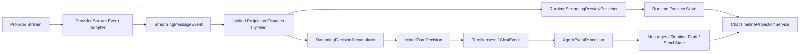

# 流式消息预览与统一投影管道设计

## 目标

本文档定义项目内流式消息预览的目标方案。

它解决的是以下问题：

1. provider 已经具备流式输出能力，但当前上层预览链路仍是扁平 snapshot 语义
2. 主链路 `TurnHarness -> ChatEvent -> AgentEventProcessor -> UI` 已经是一套稳定的事件消费模型，preview 旁路没有对齐到同样的模式
3. 临时 preview 与最终正式消息之间需要可靠的替换时序，不能依赖松散的异步更新
4. 不同 provider 的流式结构能力不同，但上层仍需要消费一套统一的 preview 事件协议

本文档只关心本次方案目标，不把 artifact 视为特例能力。
artifact 只是这条 preview 管道上的首个重点消费方。

## 非目标

本文档不负责：

1. 改写 `TurnHarness` 主循环为 mid-stream 驱动
2. 把 preview 中间态持久化进 `chat_events` / `chat_turn_steps`
3. 把 `StreamingMessageEvent` 合并进 `ChatEvent`
4. 让 UI 直接消费 provider 原始 chunk
5. 为 provider 差异引入第二套上层语义或兼容兜底链路

## 当前问题

当前系统里已经存在两条不同性质的链路：

### 1. 主真相链路

主链路已经具备清晰的事件驱动形态：

- `TurnHarness` 产出 `ChatEvent`
- `AgentEventProcessor` 消费 `ChatEvent`
- processor 写入 `messagesProvider`、`runtimeAssistantDraftProvider`、`chatSendStateProvider`
- `ChatTimelineProjectionService` 汇聚状态并产出 UI projection

这条链路表达的是 turn truth、tool workflow truth、final answer truth。

### 2. 运行中 preview 旁路

provider 流式能力当前主要停留在 LLM 层内部：

- provider stream 被适配为 `StreamingPlannerChunk`
- `StreamingDecisionAccumulator` 在 LLM 层内消费 chunk 并组装最终 `ModelTurnDecision`
- 上层通过 `runtimeSnapshots()` 得到扁平 runtime stream entries

这条链路当前存在两个核心问题：

1. 上层拿到的是 snapshot 结果，不是结构化事件流
2. preview 侧没有与主链路对齐到同样的 producer / consumer / projector 模式

结果是：

- text / reasoning / tool-use 的 preview 语义被压扁
- provider 原生 block 结构没有被保留
- final message 替换临时 preview 的时序只能靠松散清理，缺少统一仲裁点

## 总体方案判断

本次重构不改变以下基本事实：

1. `TurnHarness` 继续只消费完整 `ModelTurnDecision`
2. planner / tool loop 主语义仍然基于完整 message，而不是 mid-stream delta
3. preview 中间态仍然是 runtime-only 数据，不进入 transcript truth

本次重构改变的是 preview 旁路的表达方式：

- 从“LLM 内部 chunk -> 扁平 runtime snapshot”
- 升级为“provider stream -> 统一 preview 事件 -> runtime preview projector -> runtime preview state”

也就是说，主链路与 preview 旁路不统一事件类型，但统一为同一种架构模式：

1. 有明确 producer
2. 有明确 consumer / projector
3. 有统一的提交时序仲裁点
4. 最终汇入同一个 UI projection 层

## 分层与职责

建议长期固定为以下分层：

### 1. Provider Stream Event Adapter

职责：

- 读取 provider 原始 stream / SSE / SDK event
- 产出统一 `StreamingMessageEvent`

不负责：

- UI 状态
- final decision 语义
- transcript 落盘
- provider chunk 与上层 state 的双轨兼容

本层是 provider 流式适配的唯一出口。
不再保留旧 `StreamingPlannerChunk` 作为并行兼容链路。

### 2. StreamingMessageEvent

职责：

- 作为统一 preview 事件协议
- 表达 message 生命周期和 content block 生命周期
- 承载唯一合法的流式 delta 载体

不负责：

- turn truth
- tool workflow truth
- message 持久化语义

### 3. Unified Projection Dispatch Pipeline

职责：

- 统一消费 `StreamingMessageEvent` 与 `ChatEvent`
- 串行提交所有 preview 与 truth 更新
- 负责 preview/final 替换时序仲裁

这是本次方案里的关键新增点。
它不是新的业务事件模型，而是统一提交管道。

### 4. RuntimeStreamingPreviewProjector

职责：

- 消费 `StreamingMessageEvent`
- 折叠出 runtime-only preview state

不负责：

- 最终 decision
- transcript truth
- provider 原始 delta 解析

### 5. StreamingDecisionAccumulator

职责：

- 消费 `StreamingMessageEvent`
- 组装最终 `ModelTurnDecision`
- 回组 provider-shaped `raw_assistant_message`

不负责：

- UI preview
- provider 原始事件解析

### 6. ChatEvent / AgentEventProcessor

职责保持不变：

- `TurnHarness` 继续产出 `ChatEvent`
- `AgentEventProcessor` 继续消费 turn truth 事件
- `ChatTimelineProjectionService` 继续作为唯一 UI 汇聚层

## 统一 preview 事件模型

### 目标

preview 事件协议需要满足：

1. 能表达 message 与 content block 两层结构
2. 能承载 text、thinking、tool_use 三种 block
3. 能让 provider 在适配层内确定 id 策略，而不是让上层运行时猜测
4. 能让 accumulator 与 preview projector 共用同一份增量事实

### 事件类型

统一事件协议包含五类事件：

1. `message_start`
2. `message_stop`
3. `content_block_start`
4. `content_block_delta`
5. `content_block_stop`

只有 `content_block_delta` 携带增量内容。

### content block 类型

统一支持三类 block：

1. `text`
2. `thinking`
3. `tool_use`

### delta 类型

统一 delta 类型保持最小集合：

1. `text`
2. `thinking`
3. `input_json`
4. `signature`

其中：

- `text` 和 `thinking` 对应可见文本增量
- `input_json` 对应 tool_use 的参数增量
- `signature` 对应少量 provider 的 thinking 元信息

### 字段原则

本次遵循最少字段原则。

统一事件协议中不引入以下字段：

1. `updatedAt`
2. `argumentsText`
3. `turnId`
4. `sequence`

时序由统一提交管道保证，不由事件字段承担。

## message 与 content block 语义

### message 语义

统一 preview 协议中的 `message` 表示：

- 一次 assistant 输出的统一包络

它不要求与 provider 原生 `message` 对象严格同名同构。

因此：

- Anthropic 中 `message` 与 provider 原生概念基本一致
- OpenAI Responses 中 `message` 是基于一次 `response` 的 preview 包络
- Chat Completions 中 `message` 是 synthetic envelope

### content block 语义

`content_block` 表示：

- message 包络中的一个有序输出块

它可以是：

- 一段思考
- 一段正文
- 一个 tool_use

block 是 delta 消费、preview 渲染、final raw message 回组的最小正确粒度。

## provider 风格与 id 策略

id 策略在设计时按 provider style 预先确定，不依赖运行时模糊修复。

### 1. Anthropic Messages

#### message_id

- 直接使用 provider `message.id`

#### content_block_id

- `tool_use`：使用 `message_id:block_index` 作为 block id
- `text/thinking`：使用 `message_id:block_index`

#### tool_use_id

- 直接使用 provider `tool_use.id`

#### 判断

Anthropic 是原生 block 型 provider。
它天然具备：

- `message_start`
- `content_block_start`
- `content_block_delta`
- `content_block_stop`
- `message_stop`

### 2. OpenAI Responses

#### message_id

- 直接使用 `response_id`

#### content_block_id

- `text`：`message_id:item:{item_id}:content:{content_index}`
- `thinking`：`message_id:item:{item_id}:summary:{summary_index}`
- `tool_use`：`message_id:item:{item_id}`

#### tool_use_id

- 优先使用 `call_id`
- 无 `call_id` 时退回 `item_id`

#### 判断

Responses 是真 block 型 provider。
它虽然不总是以“message.content 数组”暴露，但在流式事件层已经具备足够细的 item / content / summary 结构。

### 3. OpenAI Chat Completions

#### message_id

- 直接使用 chunk 顶层 `id`

#### content_block_id

- `text`：`message_id:text`
- `thinking`：`message_id:thinking`
- `tool_use`：`message_id:tool:{index}`

#### tool_use_id

- 优先使用 provider `tool_call.id`
- 缺失时退回 `message_id:tool:{index}`

#### 判断

Chat Completions 是 synthetic block 型 provider。
它没有原生 content block 生命周期，因此需要在 adapter 层显式合成：

- 单一 text block
- 单一 thinking block
- 多个 tool_use block

这套 synthetic 规则必须在适配层写死，不应上抬给 accumulator 或 UI 猜测。

## delta 的生产、传递与消费

### 1. delta 生产边界

只有 provider stream adapter 可以生产统一 delta。

也就是说：

- Anthropic SDK event
- Responses SSE event
- Chat Completions chunk

必须先被适配为 `StreamingMessageEvent`，再进入上层管道。

除了 adapter，其他层不允许再次从原始 provider 数据“重新生产 delta”。

### 2. delta 传递方式

系统内部只有一条 preview 事件事实流：

- `Stream<StreamingMessageEvent>`

统一提交管道按顺序消费它，并同步分发给：

1. `StreamingDecisionAccumulator`
2. `RuntimeStreamingPreviewProjector`

系统不依赖 broadcast stream 多订阅语义来保证顺序。
顺序由统一提交管道的串行提交负责。

### 3. delta 消费方式

`StreamingDecisionAccumulator` 消费 delta，用于：

- 累积 text / thinking / tool_use 输入
- 构建最终 `ModelTurnDecision`
- 回组 `raw_assistant_message`

`RuntimeStreamingPreviewProjector` 消费 delta，用于：

- 维护当前 runtime-only preview state
- 支撑 UI 渐进可见中间态

两者消费同一份 delta 事实，但产物不同。

## 统一消费管道与时序仲裁

### 为什么需要统一消费管道

`StreamingMessageEvent` 与 `ChatEvent` 不应合并为同一种事件。
但二者必须进入同一个串行提交管道。

原因是：

1. 临时 preview 和最终正式消息存在替换关系
2. 最终替换不只是清理 preview，而是一次有顺序要求的提交事务
3. 如果 preview 和 truth 各自直接写状态，时序会依赖异步调度而变得脆弱

因此：

- `StreamingMessageEvent` 与 `ChatEvent` 可以继承同一上层接口
- 但它们进入的是同一个统一消费与提交管道

### 统一消费管道的职责

统一管道负责：

1. 串行消费 preview 与 truth 事件
2. 统一仲裁 preview 与 final 的替换顺序
3. 防止 finalized message 被晚到 delta 污染
4. 控制相邻 message 的可见提交顺序

它不负责：

1. provider 原始 stream 解析
2. final decision 组装
3. UI projection 细节

### 时序规则

统一提交管道必须满足以下规则。

#### 1. delta 先于 final replace 完成提交

对于同一个 `message_id`：

- 最后一个 delta 可以晚于前面的 delta 到达
- 但一旦 `finalAnswer` 或等价 final truth 事件开始提交
- 必须先完成该 message 的 preview 清理
- 再提交正式消息

#### 2. finalized 后拒绝该 message 的晚到 preview

统一管道要维护 message 的可见生命周期：

- `streaming`
- `finalizing`
- `finalized`

当某个 `message_id` 已 `finalized` 后：

- 若再收到该 `message_id` 的 preview event
- 必须丢弃并记录日志

#### 3. 下一个 message 的 preview 不得抢在前一个 final replace 之前可见

对于相邻两个 message：

- 新 message 的 preview event 可以先进入队列
- 但其可见提交不能早于上一个 message 的 final replace 完成

系统控制的是提交顺序，而不是网络到达顺序。

### 为什么不用时间戳字段

本次不引入 `updatedAt`、`sequence` 之类字段来描述顺序。

原因是：

1. 当前系统已经具备统一事件生产与统一状态提交的条件
2. 顺序应由管道保证，而不是把排序责任推给数据字段
3. 额外字段会很快演变成第二套弱约束协议

## preview state 与 UI 汇聚层

### preview state 的定位

preview projector 产出的 state 属于 runtime-only read model。

它：

- 可以丢失
- 不需要跨重启恢复
- 不进入 transcript truth
- 不参与 session context 回放

### UI 汇聚层

`ChatTimelineProjectionService` 继续作为唯一 UI 汇聚层。

这意味着：

1. 主链路 truth state 与 preview state 都不直接决定最终卡片形态
2. UI 继续只看统一 projection
3. preview 旁路不再自行形成第二套 timeline 解释逻辑

本次架构收敛的目标，是让 preview 链路也对齐到：

- producer
- consumer / projector
- state
- unified projection

而不是让 UI 分别消费两套底层语义。

## 与现有模块的改造边界

### 需要改造的边界

1. provider stream adapter
   - 从旧 `StreamingPlannerChunk` 硬切到 `StreamingMessageEvent`
2. `StreamingDecisionAccumulator`
   - 从扁平 buffer 改为按 ordered content block 累积
3. preview runtime state
   - 从 snapshot-like `runtimeStreamEntries` 演进到事件驱动 preview state
4. 统一消费与提交管道
   - 收敛 preview 与 truth 的状态提交顺序

### 不需要改变的边界

1. `TurnHarness` 主循环语义
2. `ChatEvent` 作为 turn truth event 的定位
3. DB schema
4. transcript append-only 真相层
5. `ChatTimelineProjectionService` 作为唯一 UI 汇聚层的定位

## 架构约束

为避免再次演化出两套互不复用的流式逻辑，后续实现必须遵守以下约束：

1. provider stream 适配层只保留一条正式出口：`StreamingMessageEvent`
2. 不再并行维护旧 `StreamingPlannerChunk` 作为兼容主链路
3. preview 中间态不进入 transcript truth 或持久化层
4. `StreamingMessageEvent` 与 `ChatEvent` 不合并为同一业务事件模型
5. 两类事件必须进入同一个统一提交管道
6. `ChatTimelineProjectionService` 继续是唯一 UI 汇聚层
7. tool-use、thinking、text 的 preview 统一通过 content block 语义表达，不新增 artifact 专属协议

## 对 artifact 的影响

artifact 不再需要一条专属流式协议。

它的定位是：

- 作为 `tool_use(create_artifact)` 的专门 renderer
- 从统一 preview state 中读取同一个 tool_use block 的参数累积结果
- 结合最终正式消息完成一致性替换

这意味着：

1. artifact 是首个高价值消费方
2. artifact 不是 preview 架构的例外
3. 后续其他工具若需要渐进渲染，应复用同一 preview 事件与统一提交管道

## 总结

本次目标架构可以概括为：

1. 主链路继续保持“完整 decision 驱动的 turn truth”
2. preview 旁路升级为“统一 message/block 事件驱动的 runtime preview”
3. `StreamingMessageEvent` 与 `ChatEvent` 不合并类型，但共享同一消费提交管道
4. provider 差异在 adapter 层吸收，上层统一消费 message / content block 语义
5. final message 替换临时 preview 的正确性依赖统一提交时序，而不是额外字段

这套结构的核心价值不是“更流式”，而是：

- 让 provider 流式能力有正式上层契约
- 让 preview 链路与主链路在架构模式上收敛
- 让最终一致性与时序控制成为一等设计目标
